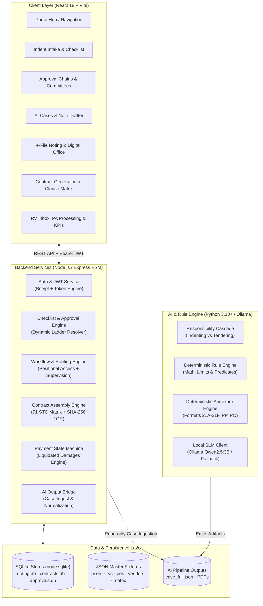
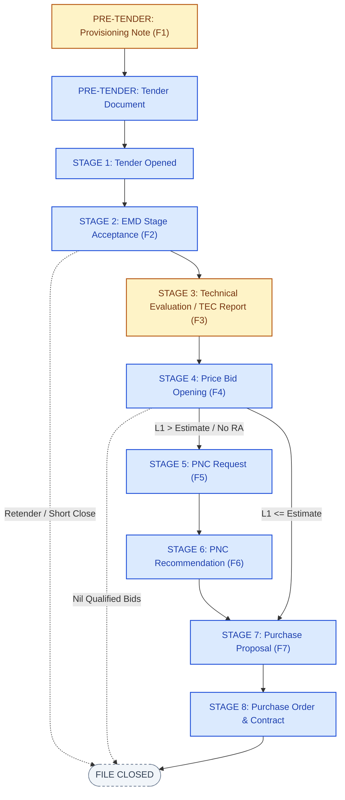

# HAL Nashik — Integrated Digital Procurement & e-Office Portal

[](https://nodejs.org/)
[](https://react.dev/)
[](https://vitejs.dev/)
[](https://python.org/)
[](https://ollama.ai/)
[](https://docker.com/)
[](sampleData/)

An enterprise-grade, end-to-end digital procurement, AI-assisted e-noting, contract generation, and payment lifecycle management portal built for **Hindustan Aeronautics Limited (HAL), Nashik Division (Aircraft Overhaul Division - AOD)**.

The system digitizes and automates public procurement workflows governed by **DOP-2025 (Delegation of Powers)**, **HAL Purchase Manual (Issue-4)**, and the **Government e-Marketplace (GeM)** framework, covering the entire lifecycle from requisition indenting to CPPC payment release.

---

## Table of Contents

- [Executive Summary & Core Principles](#executive-summary--core-principles)
- [System Architecture](#system-architecture)
- [End-to-End Procurement Lifecycle](#end-to-end-procurement-lifecycle)
- [Key Modules & Capabilities](#key-modules--capabilities)
  - [1. Indent Intake & Dynamic Approval Chains](#1-indent-intake--dynamic-approval-chains)
  - [2. AI Procurement Note Pipeline & Responsibility Cascade](#2-ai-procurement-note-pipeline--responsibility-cascade)
  - [3. e-File Noting Workflow & Digital Office](#3-e-file-noting-workflow--digital-office)
  - [4. Intelligent Contract Generation & Clause Matrix](#4-intelligent-contract-generation--clause-matrix)
  - [5. Receipt Voucher (RV) & Payment Advice Engine](#5-receipt-voucher-rv--payment-advice-engine)
  - [6. Payment Analytics & Executive SLA Dashboards](#6-payment-analytics--executive-sla-dashboards)
- [Security, Governance & Access Model](#security-governance--access-model)
- [Technology Stack](#technology-stack)
- [Repository Structure](#repository-structure)
- [Quick Start Guide](#quick-start-guide)
- [Test Credentials & Persona Matrix](#test-credentials--persona-matrix)
- [Docker & Air-Gapped LAN Deployment](#docker--air-gapped-lan-deployment)
- [Automated Verification & Diagnostics](#automated-verification--diagnostics)
- [Companion Documentation](#companion-documentation)

---

## Executive Summary & Core Principles

Public procurement in defence aerospace demands rigorous compliance, multi-tiered auditability, and zero tolerance for calculation drift. This portal addresses these imperatives through three foundational design rules:

1. **Zero-Hallucination AI Architecture (Deterministic Rules + SLM Narration):**
   The local Small Language Model (SLM via Ollama) is strictly confined to drafting contextual narrative prose. All financial computations, statutory percentages (SD 5%, PBG 10%, LD 0.5%/week), threshold evaluations, stage routing rules, and DOP authority levels are executed in deterministic, auditable code.
2. **Positional & Tenure-Aware Access Control:**
   Beyond static role privileges, access to sensitive procurement notes is governed by real-time file custody, historical participation in the routing chain, security classification grade, and tenure-bounded organizational supervision.
3. **80% Carry-Forward Single Source of Truth:**
   Procurement files accumulate evidence sequentially across stages (F1 through F7). The system maintains an immutable case accumulator where preceding stages carry forward automatically, eliminating manual re-typing and transcription errors.

---

## System Architecture



---

## End-to-End Procurement Lifecycle

```mermaid
flowchart LR
    A["1. Requisition<br/>& Indent Intake"] --> B["2. Approval Chain<br/>& Release Gate"]
    B --> C["3. AI Note Drafting<br/>(F1 Provisioning)"]
    C --> D["4. Tendering<br/>& Bid Evaluation"]
    D --> E["5. e-Noting Approval<br/>(F2 - F7 / PO)"]
    E --> F["6. Contract Generation<br/>(SHA-256 + QR)"]
    F --> G["7. Goods Inward<br/>(RV & FTR/QC)"]
    G --> H["8. Payment Advice<br/>& CPPC Release"]

    classDef stage fill:#f8fafc,stroke:#3b82f6,stroke-width:2px,color:#1e293b;
    class A,B,C,D,E,F,G,H stage;
```



---

## Key Modules & Capabilities

### 1. Indent Intake & Dynamic Approval Chains
- **67-Point Indentor Checklist:** Dynamic intake form covering 25 provisioning criteria and 42 tender specification parameters.
- **Dynamic Approval Ladder Computation:** Answers in the checklist automatically recompute who must approve the indent based on specific criteria (e.g., PAC/OEM certification, single tender justification, foreign currency, delivery timeline deviations).
- **Committee Formulation:** Dynamic setup and voting records for Departmental Purchase Committees (DPC) and Price Negotiation Committees (PNC).
- **Release Gate Validation:** Blocks downstream tender flotation until all mandatory prerequisite clearances and financial concurrences are recorded.

### 2. AI Procurement Note Pipeline & Responsibility Cascade
- **Strict Agency Responsibility Separation:** Encodes the client's official responsibility matrix:
  - **Indenting Agency:** Owns Indent Inputs, Provisioning Note (F1), and Technical Evaluation Committee (TEC) Report (F3).
  - **Tendering Agency:** Owns Tender Document, EMD Scrutiny (F2), Price Bid Opening (F4), Price Negotiation Committee (F5/F6), Purchase Proposal (F7), and Purchase Order / Contract issuance.
- **Interactive Responsibility Cascade CLI (`ai/run.py`):** Enforces desk custody, blocks unauthorized cross-agency actions, and tracks hand-over counts.
- **Deterministic 11-Annexure Builder (`ai/formats.py`):** Automatically produces HAL standard annexures (Formats 21A–21F, CST, PJS, Price Schedule, Commercial Terms) with 100% mathematical accuracy.
- **SLM Narrative Synthesis:** Ollama drafts only the newly introduced justification section for the current stage.



### 3. e-File Noting Workflow & Digital Office
- **Unified Case File (`AOD/<DEPT>/<YEAR>/<NNNN>`):** Maintains the entire case with sequenced notes (`N1...Nn`) and globally unique transaction IDs (`TXN-<YEAR>-<NNNNNN>`).
- **Positional Authorization Engine:** Rights are dynamically derived based on who holds the file, prior routing participation, and supervisory hierarchy.
- **Dynamic Routing & Safety Controls:**
  - **Forward / Send-Back:** Forward to any colleague or return strictly to prior participants or the initiator.
  - **Instant Retract:** Retract a forwarded note before the recipient opens it.
  - **Automatic Comment Normalization:** Empty or symbol-only forward remarks (`.`, `,`, `*`) are automatically converted to standard `"Concurred & Forwarded"`.
  - **In-file Clarifications:** Private, two-party inquiry threads between note holders.
  - **Stamping & DoP Attachments:** Dedicated attachment classification for official sanctions.
- **Security Classifications:** Graded access enforcement across **Normal**, **Restricted**, **Confidential**, **Secret**, and **Top Secret** with leak-proof need-to-know access tokens.
- **Tenure-Bounded Supervision:** Former department heads can only review files active during their posting window; active heads supervise their entire division subtree.
- **Post-PO Amendments:** Reopen closed cases for need-based amendments while maintaining complete lifecycle audit logs.

### 4. Intelligent Contract Generation & Clause Matrix
- **71 Standard Terms & Conditions (STC) × 8 Contract Types:** Automated clause crawling from the official HAL matrix (Supply Indigenous, Turnkey, Rate Contract, Service/AMC, Capital Equipment, etc.).
- **Smart Matrix Filtering:** Automatically classifies clauses into `Mandatory/Auto`, `Excluded`, and `Conditional/Selectable`.
- **Tamper-Evident SHA-256 Hash & Dynamic QR Code:** Finalizing a contract freezes content, computes a cryptographic digest, and stamps a scannable QR code verification payload.
- **Clause Versioning & Admin Vetting:** Any clause modification requires an administrative role, mandatory change note, and legal vetting reference document, snapshotting clause text to protect existing contracts.
- **Simulated Smart Contract Ledger:** Interactive ledger anchor demonstration verifying contract authenticity.

### 5. Receipt Voucher (RV) & Payment Advice Engine
- **Goods Receipt Trigger (RV / RR):** Ingests Receipt Vouchers directly from stores inward and QC inspection.
- **Deterministic Liquidated Damages (LD) Calculator:** Re-evaluates delivery delays, grace periods, LD percentages (0.5%/week capped at 10%), and deductions strictly server-side (`server/ld.js`).
- **5-Stage State Machine:**
  1. `rv_pending` → Receipt voucher awaiting Maker processing.
  2. `pa_created` → Maker prepares Payment Advice with tax, securities, and LD entries.
  3. `forwarded_to_officer` → Purchase Officer reviews and verifies compliance.
  4. `at_payment_desk` → Payment Desk compiles the 23-point checklist note.
  5. `sent_to_hod` / `stamped_by_hod` → HOD IMM approves and stamps.
  6. `sent_to_cppc` / `paid` → Centralised Payment Processing Cell releases funds with PRR/PPR.
- **Dual Official Hand-Off Formats:**
  - **Payment Recommendation Report** (Officer → Payment Desk).
  - **Payment Advice to HOD** with the complete 23-point statutory verification checklist.

### 6. Payment Analytics & Executive SLA Dashboards
- **Aging & SLA Tracking:** Real-time visual aging badges (Green ≤ 15 days, Amber 16–25 days, Red > 25 days / Critical 30-day limit).
- **Payment KPIs (`/payment-kpis`):** Interactive metrics for average cycle time, vendor processing turnarounds, total liquidated damages recovered, and stage-wise bottlenecks.
- **Export Capabilities:** Full audit registers with one-click CSV data export.

---

## Security, Governance & Access Model

The portal implements a dual-layer security model combining authentication-level roles with real-time positional authority:

### Positional Access Matrix (e-File Noting)

| Capability | HAL Member | File Initiator | Current Custodian | Recipient / Checker | Approving Authority | Supervisory Head |
|:---|:---:|:---:|:---:|:---:|:---:|:---:|
| Initiate File / Draft N1 | ✅ | — | — | — | — | — |
| Edit Active Draft | — | ✅ | ✅ (Draft stage) | — | — | — |
| Forward Note / Send for Check | — | ✅ | ✅ | — | — | — |
| Raise / Reply Clarification | — | ✅ | ✅ | ✅ | ✅ | — |
| Attach Stamping / DoP Ref | — | ✅ (Only) | — | — | — | — |
| Send Back to Prior Holder | — | — | ✅ | — | ✅ | — |
| Retract Unopened Note | — | — | ✅ (Sender) | — | — | — |
| Approve / Reject Note | — | — | — | — | ✅ (Only) | — |
| View Normal File | ✅ | ✅ | ✅ | ✅ | ✅ | ✅ |
| View Graded File (Restricted/Confidential) | ❌ | ✅ | ✅ | Grantee | ✅ | ✅ (Tenure) |
| View Secret / Top Secret | ❌ | ✅ | ✅ | Grantee | ✅ | Direct Head / Token |
| Generate Next Stage Note (N2...Nn) | — | ✅ | Participant | — | — | — |

---

## Technology Stack

```
HAL Procurement Portal
├── Frontend (client/)
│   ├── Framework: React 18.3 (JSX)
│   ├── Tooling: Vite 6.0
│   ├── Routing: React Router DOM 6.28
│   ├── Visualizations: Recharts 3.10
│   ├── Rich Text / QR: React-Quill 2.0, QRCode.react 4.2
│   └── Styling: Pure Modular Vanilla CSS (Design System Tokens)
│
├── Backend (server/)
│   ├── Runtime: Node.js (ES Modules, "type": "module")
│   ├── Framework: Express 4.21
│   ├── Persistence: node:sqlite (Zero native compilation dependency)
│   ├── Enterprise DB: PostgreSQL 16 ready (pg 8.23 + migration tool)
│   ├── Security: JSON Web Token (jsonwebtoken 9.0), BcryptJS 2.4
│   └── File Storage: Multer 2.2
│
└── AI & Rule Engine (ai/)
    ├── Runtime: Python 3.10+
    ├── Local SLM: Ollama (Qwen2.5-3B model)
    ├── PDF Generation: ReportLab
    └── Document Extractors: PyMuPDF (fitz), Python-docx, OpenPyXL
```

---

## Repository Structure

```
HAL_Procurement_Portal/
├── ai/                                # Module B: Python AI Noting & Responsibility Cascade
│   ├── cascade.py                     # Responsibility cascade schema (stages, owners, formats)
│   ├── cascade_check.py               # 59-point automated verification against official xlsx
│   ├── interactive.py                 # Interactive terminal decision-tree runner
│   ├── pipeline.py                    # Stage orchestrator (delta -> carry-forward -> SLM)
│   ├── rules.py                       # Deterministic money math & branch conditions
│   ├── formats.py                     # 11 deterministic HAL standard annexure builders
│   ├── stages.py                      # Canonical graph (10 sequential stages + need-based)
│   ├── prompts.json                   # Stage-wise prompts for the SLM
│   ├── run.py                         # CLI entry point (--auto or interactive)
│   └── tools/                         # SLM client, ReportLab PDF writer & document extractors
│
├── client/                            # Frontend Web Application (React + Vite)
│   ├── src/
│   │   ├── components/                # Reusable UI (DataGrid, StatusPill, Header, RoleSwitcher)
│   │   ├── config/                    # Column definitions, roles, SLA limits & color maps
│   │   ├── context/                   # AuthContext (JWT) and RoleContext (Preview Switcher)
│   │   ├── lib/                       # API client, currency (₹ lakh/crore), date helpers
│   │   └── screens/                   # Modular feature screens
│   │       ├── AiCases/               # Interactive AI case runner & review screen
│   │       ├── AiDocuments/           # Read-only viewer for AI notes with print isolation
│   │       ├── Approvals/             # Indent intake checklist & dynamic approval chains
│   │       ├── Contracts/             # Contract generator, register & 72-clause library
│   │       ├── Noting/                # e-File noting (Inbox, Files, Cabinet, Reports, Detail)
│   │       ├── PaymentAdvice/         # Maker PA preparation & Liquidated Damages
│   │       ├── PaymentKpis/           # Executive SLA dashboards & cycle time analytics
│   │       ├── PaymentRegister/       # Historical payment registry with CSV export
│   │       ├── ProcessPayment/        # Payment Desk processing & checklist compilation
│   │       └── RvInbox/               # Receipt voucher aging & SLA queue
│   └── index.html                     # SPA entry point with responsive viewport
│
├── server/                            # Backend API Server (Node.js Express)
│   ├── approvals/                     # Checklist evaluation, approval chains & committees
│   ├── auth/                          # User authentication, password hashing & JWT handlers
│   ├── contracts/                     # 71-clause matrix parser, generator, QR & SQLite store
│   ├── database/                      # Optional PostgreSQL schema & migration runner
│   ├── middleware/                    # authMiddleware (JWT) & requireAdmin guards
│   ├── mock/                          # Master JSON fixtures (users, rvs, pos, vendors)
│   ├── noting/                        # e-File SQLite store, workflow engine, identity & refs
│   ├── routes/                        # Express API route controllers
│   ├── ld.js                          # Deterministic Liquidated Damages calculation engine
│   ├── stateMachine.js                # Payment Advice lifecycle state transitions
│   └── index.js                       # Express server bootstrapping & route mounting
│
├── sampleData/                        # Client purchase formats, templates & validation references
├── docker-compose.yml                 # Full-stack container orchestration
├── Dockerfile                         # Production container definition
├── CLAUDE.md                          # Architecture invariants & developer guidance
├── USER_GUIDE.md                      # Comprehensive user walkthrough of all screens
└── WORKFLOW_GUIDE.md                  # Deep dive into Noting, Contracts & AI Documents
```

---

## Quick Start Guide

### Prerequisites
- **Node.js**: v18.0.0 or higher
- **npm**: v9.0.0 or higher
- *(Optional for AI CLI)*: Python 3.10+ with Conda, and [Ollama](https://ollama.ai/) with `qwen2.5:3b`.

### 1. Installation

Clone the repository and install all dependencies for both `client` and `server` in a single command via npm workspaces:

```bash
git clone https://github.com/alpha08-prog/HAL_Procurement_Portal.git
cd HAL_Procurement_Portal
npm install
```

*(Optional — to enable the local Python AI drafting pipeline)*:
```bash
conda create -n hal python=3.10 -y
conda run -n hal pip install pymupdf python-docx requests reportlab openpyxl
```

### 2. Running the Application

Launch both the backend API server (`localhost:3001`) and the Vite development client (`localhost:5173`) concurrently:

```bash
npm run dev
```

Once the terminal outputs both startup confirmation lines, open your browser:
👉 **[http://localhost:5173](http://localhost:5173)**

> [!NOTE]
> The Vite frontend on port `5173` automatically proxies all `/api/*` HTTP requests to the backend on port `3001`. Do not open port `3001` directly in the browser.

### 3. Running the AI Pipeline CLI (Optional)

In a separate terminal, launch Ollama and run the interactive responsibility cascade:

```bash
# Terminal 1: Start local language model
ollama serve
ollama pull qwen2.5:3b

# Terminal 2: Run interactive cascade
conda run --no-capture-output -n hal python ai/run.py
```

---

## Test Credentials & Persona Matrix

All pre-seeded test accounts share the unified password: **`hal@1234`**

| Email | Role | Department / Position | Accessible Modules & Permissions |
|:---|:---|:---|:---|
| **`admin@hal.local`** | `admin` | System Administrator | **Full Access** + Live Top-Bar Role Switcher & Clause Editor |
| **`test@hal.local`** | `admin` | QA Administrator | **Full Access** + Live Top-Bar Role Switcher |
| **`indentor@hal.local`** | `indentor` | Indenting Officer | Indent Intake, Provisioning Notes, Register, AI Cases |
| **`maker@hal.local`** | `purchase_maker` | Purchase Maker (IMM) | RV Inbox, Draft PA Preparation, Contract Generation, Initiating Files |
| **`officer@hal.local`** | `purchase_officer` | Purchase Officer (IMM) | Forward Advice Review, Noting Routing, Retract Unopened Files |
| **`desk@hal.local`** | `payment_desk` | Payment Desk (Finance) | Process Payment, 23-Point Checklist Compilation, Share-Link Recipient |
| **`hod@hal.local`** | `hod_imm` | Head of Dept (IMM) | HOD Approval Stamping, Final Approvals, Retrieve From Cabinet |
| **`gm@hal.local`** | `hod_imm` | General Manager (AOD) | Division-Wide Supervision of Files across All Departments |
| **`cm@hal.local`** | `hod_imm` | Chief Manager (Purchase) | Direct-Head "Secret" Grade & Top-Secret Participant Visibility |
| **`stores@hal.local`** | `stores_inspection` | Stores & Inward Inspection | Goods Receipt Verification, RV Registry |

---

## Docker & Air-Gapped LAN Deployment

The application includes a complete containerized setup incorporating **PostgreSQL 16**, the **Node.js Express API**, and **Nginx serving the optimized React SPA**.

### 1. Single-Command Launch (Connected Environment)

```bash
docker compose up --build -d
```

Access the portal on port 80: **`http://localhost`** (or `http://<server-ip>` over LAN).

### 2. Air-Gapped / Offline Defence Network Deployment

For secure, offline on-premise servers:

```bash
# Step 1: On an internet-connected build workstation
docker compose build
docker save -o hal_procurement_images.tar postgres:16-alpine hal_procurement_portal-server hal_procurement_portal-client

# Step 2: Transfer hal_procurement_images.tar and docker-compose.yml via approved storage to the server

# Step 3: On the offline LAN server
docker load -i hal_procurement_images.tar
docker compose up -d
```

---

## Automated Verification & Diagnostics

The project includes specialized regression test suites and constraint verifiers:

```bash
# 1. Assert Liquidated Damages math & grace period logic
node server/ld.check.mjs

# 2. Run e-File Noting workflow regression checks (isolated throwaway DB)
node server/noting/noting.check.mjs

# 3. Run Contract Generation & Clause Matrix regression checks
node server/contracts/contracts.check.mjs

# 4. Verify AI cascade rules against official client spreadsheet (59/59 checks)
conda run -n hal python ai/cascade_check.py

# 5. Score AI generated note facts against gold sample notes
conda run -n hal python ai/validate.py
```

---

## Companion Documentation

For in-depth operational and architectural details, refer to the specialized reference documents:

- 📘 **[`USER_GUIDE.md`](USER_GUIDE.md)** — Complete step-by-step walkthrough of every screen, button, decision rule, and common setup pitfalls.
- 📙 **[`WORKFLOW_GUIDE.md`](WORKFLOW_GUIDE.md)** — Deep dive into e-File Noting, Contract Generation, and the AI Documents viewer with recommended demo sequences.
- 🏛️ **[`PROJECT_OVERVIEW.md`](PROJECT_OVERVIEW.md)** — Comprehensive glossary, procurement lifecycle breakdown, and sample file mapping.
- 🧠 **[`ai/ARCHITECTURE.md`](ai/ARCHITECTURE.md)** — Theoretical architecture, data contracts, and prompt design of the AI procurement noting engine.
- 🔀 **[`ai/CASCADE.md`](ai/CASCADE.md)** — Complete provenance, mathematical proofs, and 17 decision branch specifications for the responsibility cascade.
- 🐳 **[`DOCKER_DEPLOYMENT.md`](DOCKER_DEPLOYMENT.md)** — Detailed instructions for enterprise container operations and database maintenance.

---

<p align="center">
  <b>Hindustan Aeronautics Limited — Nashik Division</b><br/>
  <i>Aircraft Overhaul Division (AOD) · Digital Procurement & e-Office Initiative</i>
</p>
