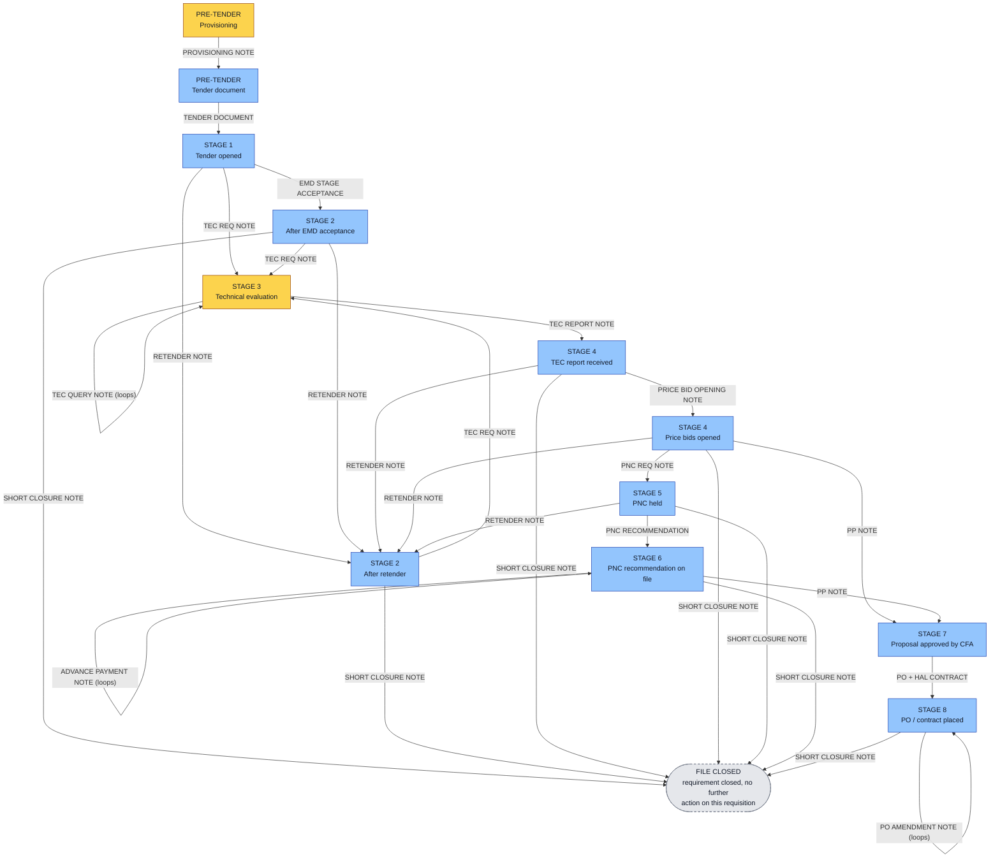

# HAL Nashik — Procurement Portal (Prototype)

Clickable prototype of the HAL Nashik public-procurement portal, for client demos and
feedback. Mock data only — no real integrations. Access is gated by a **login page** with
JWT auth; each account maps to one role, which decides the screens and row actions visible.

## Stack

- **Client** — React + Vite (`client/`), plain JSX and CSS
- **Server** — Node + Express serving mock JSON fixtures (`server/`)

## Run

```bash
npm install   # installs client + server (npm workspaces)
npm run dev   # starts mock API on :3001 and Vite on :5173
```

Open http://localhost:5173. The Vite dev server proxies `/api` to Express.

**New here? Start with [`USER_GUIDE.md`](USER_GUIDE.md).** It covers how to run the portal
(including the mistakes everyone makes once) and then every flow in detail — who acts, what
they may and may not do, and why the system refuses what it refuses. It is the guide to the
whole portal, including the Approvals and AI Cases modules.

`WORKFLOW_GUIDE.md` goes deeper on the older parts: every screen and button of the AI
Documents viewer, the e-File Noting workflow and Contract Generation — including which
demo account shows which feature and a suggested 15-minute demo order.

The note-generation CLI (`ai/`) runs separately from the web app — see
[Module B](#module-b--ai-note-generation--the-responsibility-cascade-ai) below,
[`ai/ARCHITECTURE.md`](ai/ARCHITECTURE.md) and [`ai/CASCADE.md`](ai/CASCADE.md).

## Test credentials

All accounts share the password **`hal@1234`**. Each maps to one role; sign in to see only
that role's screens. The **Admin** accounts (`admin@hal.local` and the `test@hal.local` QA
login) see every screen and get a role-switcher dropdown in the top bar to preview other
roles live during a demo.

| Email                | Role                | Sees |
|----------------------|---------------------|------|
| `test@hal.local`     | Admin (QA login)    | **everything** (+ role switcher) |
| `admin@hal.local`    | Admin               | everything (+ role switcher) |
| `maker@hal.local`    | Purchase Maker      | RV Inbox, Payment Advice, Register |
| `officer@hal.local`  | Purchase Officer    | Forward Advice, Register |
| `desk@hal.local`     | Payment Desk        | Process Payment, Register |
| `hod@hal.local`      | HOD (IMM)           | HOD Approval, Register |
| `stores@hal.local`   | Stores & Inspection | Register |
| `indentor@hal.local` | Indentor            | Register |
| `gm@hal.local`       | HOD (payment side)  | GM (AOD) in the noting module — division-wide supervision demo |
| `cm@hal.local`       | HOD (payment side)  | CM (Purchase) in the noting module — direct-head "Secret" grade + top-secret participant demo |

Accounts are seeded in `server/mock/users.json` (plaintext passwords, bcrypt-hashed in memory
on boot). The JWT signing secret is read from `JWT_SECRET` (a dev fallback is used if unset).

## Module B — AI note generation & the responsibility cascade (`ai/`)

A Python CLI that assembles a procurement case once, carries prior-note prose forward
automatically, lets a local SLM (Ollama) draft only the *new* narrative section, computes
every figure in deterministic code, and renders HAL-format notes + annexures as PDF.
Design detail: [`ai/ARCHITECTURE.md`](ai/ARCHITECTURE.md). Cascade detail:
[`ai/CASCADE.md`](ai/CASCADE.md).

```bash
conda run --no-capture-output -n hal python ai/run.py           # interactive cascade (default on a TTY)
conda run --no-capture-output -n hal python ai/run.py --auto     # unattended full linear run
conda run --no-capture-output -n hal python ai/cascade_check.py  # verify the cascade against the xlsx
conda run --no-capture-output -n hal python ai/validate.py       # score notes vs gold facts
```

`--no-capture-output` matters — plain `conda run` buffers stdio and the interactive prompts
never appear (`conda activate hal && python ai/run.py` works too). With stdin not a terminal
the CLI falls back to the unattended run, so scripts and CI are unaffected.

### The two agencies

Everything below is encoded from one client document — nothing is invented:

```
sampleData/HAL PURCHASE FORMATS dt 22.06.2026/
    Note & Format Generation Stages and responsibility cascadeing.xlsx   [Sheet1]
```

| Agency | Sheet evidence | Owns |
|---|---|---|
| **Indenting Agency** | `C6:C11`, `H23`, `G26` | the indent + technical evaluation (stage 3) and the TEC Report format |
| **Tendering Agency** | `C13`, `C16:C25`, `F23:G23`, `I23:M23`, `G27:G35` | the tender document and every other stage |

The sheet's row 23, *"Note Can only be Generated by"*, is enforced at runtime: the CLI offers
only the notes the current stage allows, and only if the agency at the desk owns that stage.
Acting out of turn is refused and the file must be handed over (`h`) first — each crossing is
counted and reported. A file on the normal route crosses three times: Indenting raises the
indent, Tendering runs the tender, Indenting does the TEC, Tendering carries it to PO.

### Stage cascade — who holds the file

Colour = the agency named in row 23. Edge labels are the notes that sheet column lists.



### Every decision, and what yes / no leads to

Diamonds are decisions — amber decided by **Indenting**, blue by **Tendering**. Cell refs on
the edges are the sheet cells that authorise each outcome.

```mermaid
flowchart TD
    classDef indD fill:#fcd34d,stroke:#92400e,color:#111827
    classDef tenD fill:#93c5fd,stroke:#1e40af,color:#111827
    classDef note fill:#f5f5f4,stroke:#57534e,color:#111827
    classDef term fill:#e5e7eb,stroke:#6b7280,color:#111827,stroke-dasharray:5 4
    classDef hold fill:#fee2e2,stroke:#b91c1c,color:#111827,stroke-dasharray:3 3

    D1{"INDENT INPUTS COMPLETE?<br/>specs · scope · certs · MPR/CAR"}:::indD
    N1["PROVISIONING NOTE"]:::note
    H1(["no indent — nothing to tender"]):::hold
    D1 -->|yes| N1
    D1 -->|no| H1

    D2{"COMMERCIAL SIDE READY?<br/>cond'ns · MII/LBS/NDA/IP/SD/PBG · IFS no"}:::tenD
    N2["TENDER DOCUMENT<br/>floated on GeM / E-Proc"]:::note
    H2(["tender not floated"]):::hold
    N1 --> D2
    D2 -->|yes| N2
    D2 -->|no| H2

    D3{"STAGE 1 · BIDS WORTH PROCESSING?"}:::tenD
    N2 --> D3
    D4{"STAGE 1 · EMD SCRUTINY APPLICABLE?"}:::tenD
    N3["EMD STAGE ACCEPTANCE NOTE"]:::note
    R1["RETENDER NOTE"]:::note
    D3 -->|yes| D4
    D3 -->|"no · F8"| R1
    D4 -->|"yes · F9"| N3
    D4 -->|"no · F10"| D8

    D5{"STAGE 2 · ANY EMD-QUALIFIED BIDDER?"}:::tenD
    N3 --> D5
    D6{"STAGE 2 · RETENDER WORTH FLOATING?"}:::tenD
    X(["FILE CLOSED · SHORT CLOSURE<br/>requirement closed, no further action"]):::term
    D5 -->|"yes · G10"| D8
    D5 -->|no| D6
    D6 -->|"yes · G9"| R1
    D6 -->|"no · G11 / G17"| X

    D7{"STAGE 2 · DID THE RETENDER<br/>BRING QUALIFIED OFFERS?"}:::tenD
    R1 --> D7
    D7 -->|"yes · G10"| D8
    D7 -->|"no · G17"| X

    D8{"STAGE 3 · CLARIFICATION NEEDED<br/>FROM BIDDERS?"}:::indD
    Q1["TEC QUERY NOTE"]:::note
    D8 -->|"yes · H11"| Q1
    Q1 -->|"replies received"| D8
    D9{"STAGE 3 · EVALUATION CONCLUDED?"}:::indD
    N4["TEC REPORT NOTE<br/>accepted · rejected · spec non-compliance"]:::note
    D8 -->|no| D9
    D9 -->|"yes · H12"| N4
    D9 -->|"no — still under evaluation"| D8

    D10{"STAGE 4 · ANY TECHNICALLY<br/>ACCEPTED BIDDER?"}:::tenD
    N5["PRICE BID OPENING NOTE"]:::note
    D10b{"STAGE 4 · RETENDER WORTH FLOATING?"}:::tenD
    N4 --> D10
    D10 -->|"yes · I13"| N5
    D10 -->|no| D10b
    D10b -->|"yes · I14"| R1
    D10b -->|"no · I17"| X

    D11{"STAGE 4 · IS L1 PROCESSABLE?"}:::tenD
    N5 --> D11
    D11 -->|no| D10b
    D12{"STAGE 4 · NEGOTIATION REQUIRED?<br/>rules: L1 &gt; estimate, or no RA"}:::tenD
    N6["PNC REQ NOTE"]:::note
    N8["PP NOTE"]:::note
    D11 -->|yes| D12
    D12 -->|"yes · I16"| N6
    D12 -->|"no · I15"| N8

    D13{"STAGE 5 · ACCEPTABLE OFFER<br/>FROM NEGOTIATION?"}:::tenD
    N7["PNC RECOMMENDATION"]:::note
    D13b{"STAGE 5 · RETENDER WORTH FLOATING?"}:::tenD
    N6 --> D13
    D13 -->|"yes · J17"| N7
    D13 -->|no| D13b
    D13b -->|"yes · J16"| R1
    D13b -->|"no · J18"| X

    D14{"STAGE 6 · ADVANCE PAYMENT SOUGHT?"}:::tenD
    A1["ADVANCE PAYMENT NOTE"]:::note
    N7 --> D14
    D14 -->|"yes · K19"| A1
    A1 --> D15
    D15{"STAGE 6 · PROCEED TO<br/>PURCHASE PROPOSAL?"}:::tenD
    D14 -->|no| D15
    D15 -->|"yes · K18"| N8
    D15 -->|"no · K20"| X

    D16{"STAGE 7 · PLACE THE ORDER?"}:::tenD
    N9["PO + HAL CONTRACT"]:::note
    H3(["stays at stage 7 — the sheet<br/>offers no alternative here"]):::hold
    N8 --> D16
    D16 -->|"yes · L19"| N9
    D16 -->|no| H3

    D17{"STAGE 8 · PO NEEDS AMENDMENT?"}:::tenD
    A2["PO AMENDMENT NOTE"]:::note
    N9 --> D17
    D17 -->|"yes · M20"| A2
    A2 --> D17
    D18{"STAGE 8 · DROP THE BALANCE<br/>REQUIREMENT?"}:::tenD
    OK(["PO runs to completion"]):::term
    D17 -->|no| D18
    D18 -->|"yes · M21"| X
    D18 -->|no| OK
```



**Tendering Agency — 17 yes/no points**

| Stage | Decision | Yes → | No → |
|---|---|---|---|
| pre | Commercial conditions, formats, IFS enquiry no. ready? | Tender Document floated | tender not floated (hold) |
| 1 | Bids worth processing? | on to EMD question | **Retender Note** `F8` |
| 1 | EMD scrutiny applicable? | **EMD Stage Acceptance** `F9` | **TEC Req Note** direct `F10` |
| 2 | Any EMD-qualified bidder? | **TEC Req Note** `G10` | on to retender question |
| 2 | Retender worth floating? | **Retender Note** `G9` | **Short Closure** → closed `G11`/`G17` |
| 2 | Retender brought qualified offers? | **TEC Req Note** `G10` | **Short Closure** → closed `G17` |
| 4 | Any technically accepted bidder? | **Price Bid Opening** `I13` | on to retender question |
| 4 | Retender worth floating? | **Retender Note** `I14` | **Short Closure** → closed `I17` |
| 4 | Is L1 processable? | on to negotiation question | back to retender / short closure |
| 4 | Negotiation required? *(advised by `pnc_required()`)* | **PNC Req Note** `I16` | **PP Note** — straight to proposal `I15` |
| 5 | Acceptable offer from negotiation? | **PNC Recommendation** `J17` | on to retender question |
| 5 | Retender worth floating? | **Retender Note** `J16` | **Short Closure** → closed `J18` |
| 6 | Advance payment sought? | **Advance Payment Note** `K19`, then re-ask | skip it |
| 6 | Proceed to purchase proposal? | **PP Note** `K18` | **Short Closure** → closed `K20` |
| 7 | Place the order? | **PO + HAL Contract** `L19` | nothing — column `L` has no alternative |
| 8 | PO needs amendment? | **PO Amendment Note** `M20`, then re-ask | on to drop question |
| 8 | Drop the balance requirement? | **Short Closure** → closed `M21` | PO runs to completion |

**Indenting Agency — 3 yes/no points**

| Stage | Decision | Yes → | No → |
|---|---|---|---|
| pre | Indent inputs complete? (specs, scope, proprietary/OEM cert, single-tender cert, MPR/CAR) | **Provisioning Note** | no indent — nothing to tender |
| 3 | Clarification needed from bidders? | **TEC Query Note** `H11`, then re-ask *(loops)* | on to conclusion question |
| 3 | Evaluation concluded? | **TEC Report Note** `H12` → file returns to Tendering | stays at stage 3 |

**The asymmetry this exposes.** `RETENDER NOTE` appears only in columns `F`, `G`, `I`, `J`
and `SHORT CLOSURE NOTE` only in `G`, `I`, `J`, `K`, `M` — every one a Tendering column.
Column `H` (stage 3) has neither. So only **Tendering**'s "no" can terminate or restart a
case; **Indenting**'s "no" can only loop (raise another query) or hold the file at stage 3.
Even *"no bidder is technically compliant"* is expressed as a TEC Report listing everyone
rejected — the decision to short-close or retender on the back of it is then Tendering's, at
stage 4. Net: the indentor controls whether a case can *advance*; the tendering agency
controls whether it *lives or dies*.

### What is enforced vs merely advised

| Condition | Source | Effect |
|---|---|---|
| Notes available at a stage | sheet `F4:M21`, per column | **hard** — only those notes are offered |
| *"Note Can only be Generated by"* | sheet `F23:M23`, `C6:C25` | **hard** — blocks, forces a hand-over |
| Short closure ends the case | sheet `G18` | **hard** — terminal, file closed |
| Prerequisite formats + who owns them | sheet `F26:H35` *"Required for"*, inverted | warn only |
| Enclosures complete | sheet `B6:C25` (block 1) | warn only, pending lines recorded |
| `pnc_required()` → advises PNC Req | `rules.py` — **not in the sheet** (L1 above estimate, or no RA participation) | advisory, override with confirmation |
| `retender_required()` → advises Retender | `rules.py` — **not in the sheet** (nil bids, or no EMD-accepted bidder) | advisory, override with confirmation |

**The spreadsheet holds no conditional logic of its own** — it lists which notes are possible
at each stage and who may raise them, never when to prefer one. So every branch edge is
selectable; the only two preferences shown come from `rules.py` (derived from the Purchase
Manual and the sample notes), are labelled with their rule name, and are never binding. They
read as `undecided` until the data they depend on is actually on file (`rules.RULE_INPUTS`).

Also **not** in the sheet: approval authority. Note texts reference GM(AOD), AGM(IMM-OH),
Head of IMM, Finance concurrence, DPC and the CFA, but the sheet has no approval column, so
none of it is encoded. `rules.dop_cfa_level()` flags the same gap — the DOP-2025 Annexure-3
value-band table is not in `sampleData`, so the CFA level cannot be computed.

### Verification

`ai/cascade_check.py` re-reads the xlsx and asserts the encoding against it — stage numbering
(`row 24`), the note set of every stage column, the owning agency of every column, the block-1
responsibility split, and all ten block-3 rows with responsibility and *"Required for"*.
**59/59 checks pass.** The sheet's own typos (`ACCPETANCE`, `NEGOTAITAION`, `EVALAUTION`,
`JUSTIFCATION`) are matched verbatim, so the check fails if the encoding silently drifts.

### CLI keys

At every node: `1..n` picks a note, `f` lists the block-3 formats and who owns them, `v` prints
the file as it stands, `h` hands the file to the other agency, `q` saves and quits. Notes are
generated for real — deterministic annexures from `formats.py`, prose from the SLM, prior notes
carried forward — and the session closes with the path actually walked, the responsibility
split, the hand-over count, `ai/outputs/case_full.json` and one PDF per note.

## Module C — e-File Noting: roles & rights

The noting module (`/noting/*`) does **not** use the payment job-titles above. Any HAL user
can initiate a note; authorization is **positional** — decided by the real signed-in member's
relationship to each note (who holds it, who has routed it, who supervises the initiating
unit), enforced in `server/noting/workflow.js`. The six positions and their edit (E) /
forward (F) / view (V) rights, taken straight from the access-rights spec:

| Capability | HAL User | Initiator | Routing Member (holding) | Recipient / Checker | CFA / Decider | Supervisory Head |
|---|---|---|---|---|---|---|
| Initiate N1 / standalone | E | — | — | — | — | — |
| Set classification / edit draft | — | E | E (holding draft) | — | — | — |
| Send draft for check | — | F | F | — | — | — |
| Comment (auto "Concurred & Forwarded") | — | E+F | E+F | — | E+F | — |
| Raise / answer clarification | — | E | E | E | E | — |
| Attach reference doc | — | E | E | — | E | — |
| Attach **stamping** doc / add **DoP** ref | — | E (only) | — | — | — | — |
| Send back to user / previous member | — | F | F | — | F | — |
| Add self / next member / member twice | — | F | F | — | F | — |
| Retract just-sent (before open) | — | F | F | — | F | — |
| Approve / Reject | — | — | — | — | E (only) | — |
| Retrieve from cabinet after decision | — | — | — | — | F (decider) | — |
| Share restricted link to a person | — | F | F | — | F | — |
| View note — Normal | V | V | V | V | V | V |
| View note — Restricted (graded) | ✗ | V | V | grantee | V | V (tenure) |
| View subordinates' / predecessor files | — | — | — | — | — | V (tenure) |
| Reports + lifecycle summary | own files | own files | own files | — | — | V (subtree) |
| Create next-stage note (N2..final) | — | E (case owner) | E (participant) | — | — | — |

PM references are automatic. Restricted levels are graded: Confidential (participants + any
supervising head) < Secret (+ the direct unit/dept head only) < Top Secret (participants +
explicit grant only). Supervisory visibility is tenure-bounded via the `postings` table (a
sitting head sees his subtree's whole history; a former head only his tenure window).
A forward comment that is empty **or symbols-only** (`.` `,` `*`) is auto-replaced with
"Concurred & Forwarded" at send time. After a Purchase Order is approved and the case
closes, the cabinet offers a need-based **PO Amendment** note that reopens the case (its
own approval closes it again); amendment counts appear in the lifecycle report.

The seed (`node server/noting/seed.js` force-reseeds) ships a full demo storyline: an
in-progress NVB case with a cabinet next-stage prompt, an unopened hop for the Retract demo
(officer@ on the furniture file, test@ on the SYS file), line-wise child PPs, a predecessor-era
file, a rejected case, a closed PO case offering a PO Amendment, a confidential case with an
active need-to-know grant (`?grant=demo-grant-active-desk` for desk@) plus a revoked re-shared
grant and its leak alert (visible to officer@), and a top-secret case visible only to maker@ and cm@.

## Module D — Contract Generation (`/contracts/*`)

Generates a full HAL contract from a Purchase Order. The user supplies only the
Requisition/HAL IFS **tender no** (try `GEM/2025/B/6638737`, or `GEM/2025/B/7104412`
for a tender with two POs); the app prompts for the PO, **crawls the Standard Contract
Terms & Conditions automatically from the Contract Clauses Matrix** (71 clauses × 8
contract types, seeded verbatim from the client's xlsx + 72 clause documents), and pulls
value, item lines (with server-computed GST and landed value) and party details from the
HAL PO, and the scope of work from the Provisioning Note.

- **Generate Contract** — tender → PO dropdown → type of purchase (auto clauses locked,
  conditional clauses tickable, extra STC + user-written "Additional Clauses" + standard
  proformas to annex), 5-level classification (Normal / Restricted / Confidential /
  Secret / Top Secret). Visible to the purchase chain + admin.
- **Contract Register** — every generated contract with number, parties, value, CAR,
  tender, CFA & DOP reference, mode of tendering and the generator's name/PB/designation/
  dept/division; CSV export. Visible to all.
- **Contract view** — cover page, table of contents, numbered clauses, price-schedule
  annexure (amount in words), signature block. Drafts can be edited and **finalised**:
  finalisation locks the content, computes a SHA-256 integrity hash and stamps a
  scannable **QR code** (contract no + hash + date-time + signer credentials); printing
  adds a classification watermark and a running footer on every page. "Verify integrity"
  recomputes the hash; an optional smart-contract toggle anchors the hash to a clearly
  labelled **simulated** blockchain (demo stub). Print via the browser's Save-as-PDF
  (enable "Headers and footers" for page numbers).
- **Clause Library** — the 72 STC + the matrix grid. Read-only for everyone; **amending
  a clause is admin-only** (server-enforced on the real account role) and every amendment
  records the superseded text, who changed it, a change note and the legal-vetting
  reference doc. Amendments never alter already-generated contracts (clause bodies are
  snapshotted at generation).

Store: SQLite at `server/data/contracts.db` (`node server/contracts/seed.js` force-reseeds
the demo — one finalised "Restricted" NVB contract, one draft, one pre-seeded clause
amendment). PO/tender source data: `server/mock/pos.json`. Checks:
`node server/contracts/contracts.check.mjs`.

## Layout

```
client/public/           logos (HAL, IIIT Dharwad)
client/src/components/   shared UI (DataGrid, StatusPill, Header, RoleSwitcher, RequireAuth)
client/src/screens/      one folder per screen (incl. Login)
client/src/context/      AuthContext (JWT session) + RoleContext (role/gating)
client/src/config/       field/column configs, roles, status colours
client/src/lib/          api (auth fetch wrapper), currency (₹ lakh/crore), date (DD/MM/YYYY)
server/auth/             users seed loader + JWT helpers
server/middleware/       authMiddleware (verifies Bearer JWT on data routes)
server/mock/             JSON fixtures (RVs, payment advices, vendors, users)
server/routes/           Express API routes (incl. auth: login, me)

ai/cascade.py            the responsibility-cascading xlsx as data (stages, owners, formats)
ai/interactive.py        interactive decision-by-decision driver + agency enforcement
ai/cascade_check.py      asserts cascade.py against the xlsx (59 checks)
ai/stages.py             note definitions: fields, annexures, carry-forward (ORDER + need-based)
ai/pipeline.py           runs one note: ingest → formats → delta → carry-forward → SLM
ai/rules.py              deterministic money/level logic + branch predicates
ai/formats.py            the annexure builders (21A-21F, PP, PO, contract, advance)
ai/run.py                entry point (interactive by default, --auto for the linear run)
ai/CASCADE.md            flow diagrams, every decision, provenance & verification
```
