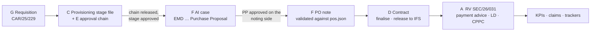
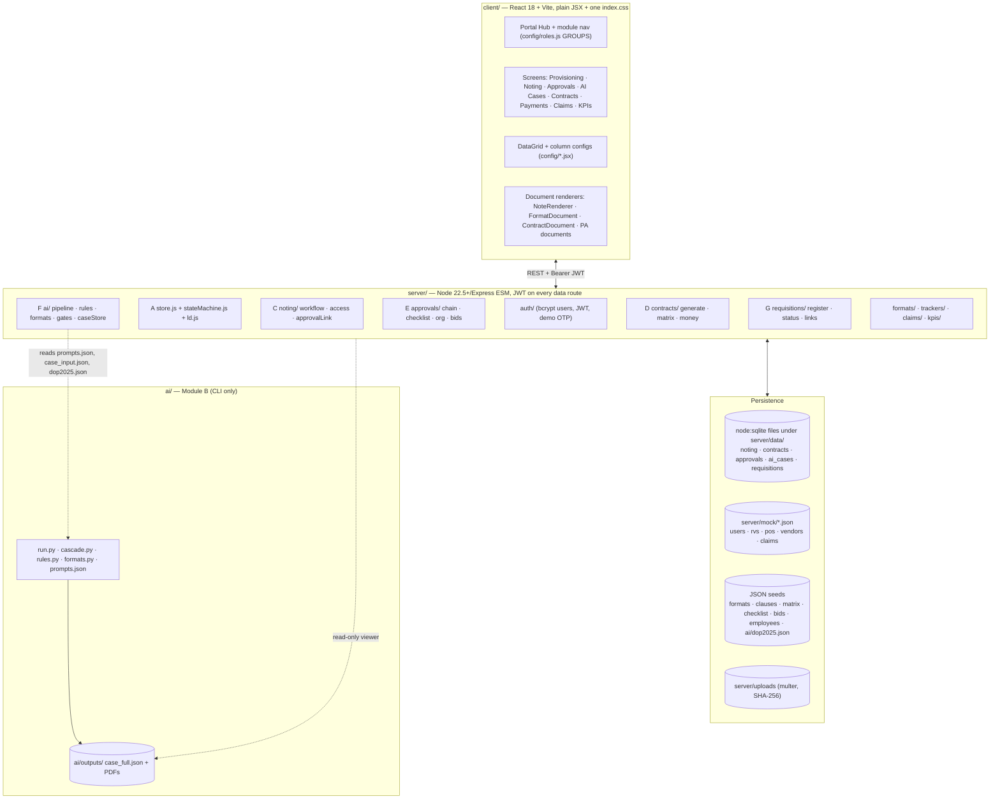

# HAL Nashik — Integrated Digital Procurement & e-Office Portal

[](https://nodejs.org/)
[](https://react.dev/)
[](https://vitejs.dev/)
[](https://python.org/)
[](https://ollama.ai/)
[](https://docker.com/)
[](sampleData/)

A clickable, end-to-end procurement portal for **Hindustan Aeronautics Limited (HAL), Nashik — Aircraft Overhaul Division (AOD)**: requisition intake, internal approval chains, AI-assisted procurement noting, e-file routing, contract generation, goods-receipt payment advice, claims and management KPIs.

It is a **prototype for client demonstrations**. Every screen is backed by a real server route and a real store, but the data is fixture and seed data: there is **no live IFS-ERP or GeM connection**. Everything the portal "fetches from IFS" comes from `server/mock/*.json`, and every screen that shows such data says so.

---

## Table of Contents

- [Design rules](#design-rules)
- [Modules](#modules)
- [The integrated storyline](#the-integrated-storyline)
- [Portal Hub — the 80 items](#portal-hub--the-80-items)
- [Architecture](#architecture)
- [Security & access model](#security--access-model)
- [Repository structure](#repository-structure)
- [Quick start](#quick-start)
- [Test credentials](#test-credentials)
- [Docker / air-gapped deployment](#docker--air-gapped-deployment)
- [Verification](#verification)
- [What still needs HAL's input](#what-still-needs-hals-input)
- [Companion documentation](#companion-documentation)

---

## Design rules

1. **The server is the single source of truth for state and money.** Liquidated damages, GST, security deposit and bank-guarantee amounts, price estimates, KPI values and every lifecycle transition are computed or applied server-side. The browser sends inputs and renders results.
2. **The language model only narrates.** In the AI note pipeline the local SLM (Ollama) drafts one new prose section per note. Figures, branch decisions, annexures and the carried-forward 80% of each note are produced in deterministic code.
3. **Access is enforced where it matters.** Every data route needs a JWT. Role checks (`requireRoles`, `requireAdmin`) and positional checks (who holds a file, who took part in it, its classification) run on the server; the client's navigation is only a convenience.
4. **Client feedback changes configuration, not architecture.** Screen columns, roles, hub items, formats, stage lists, policies and seeds are JSON or config files. Inputs HAL has not yet supplied (DOP-2025 value bands, the LD cap base, eight standard-format texts) sit in flagged config files rather than in code.
5. **Nothing is faked.** No hub item opens a placeholder card, no KPI is a typed-in number, and every fabricated dataset (the LED bid fixture) is labelled as such on screen and in the API.

---

## Modules

Code comments refer to the modules by letter.

| Module | What it does | Web routes | Server | Store |
|---|---|---|---|---|
| **A** Payment advice | RV → payment advice → officer → payment desk → HOD → CPPC, with LD, securities, credit notes and document uploads | `/rv-inbox` `/payment-advice` `/forward-advice` `/process-payment` `/hod-approval` `/payment-register` `/payment-kpis` | `store.js` `stateMachine.js` `ld.js` `routes/{rvs,paymentAdvices,paFiles}.js` | in-memory (resets on restart) |
| **B** AI noting pipeline (Python CLI) | Drafts the F1–F7 procurement notes and annexures from `ai/case_input.json` | `/noting/ai-documents` (read-only viewer) | `routes/ai.js` reads `ai/outputs/` | files (gitignored) |
| **C** e-File noting | Stage files per proposal, dynamic routing, custody, classification, clarifications, delegation, need-to-know sharing | `/noting/*` | `noting/` `routes/noting/` | `server/data/noting.db` |
| **D** Contracts | PO → contract from the 71 × 8 clause matrix, snapshots, SHA-256 + QR, release to IFS, verify/decrypt | `/contracts/*` | `contracts/` `routes/contracts/` | `server/data/contracts.db` |
| **E** Approval chains | Checklist-driven internal approval chains with hop types, riders, OTP and a release gate | `/approvals/*` | `approvals/` `routes/approvals/` | `server/data/approvals.db` |
| **F** AI cases | The live, in-browser Node port of B: a shared file walking the responsibility cascade under agency custody | `/ai-cases` | `server/ai/` `routes/aiCases.js` | `server/data/ai_cases.db` |
| **G** Requisitions | MPR/CAR/CPR/SPR register with server-side price estimates, derived status and links to every other module | `/provisioning` | `requisitions/` `routes/requisitions.js` | `server/data/requisitions.db` |
| Formats | 36 HAL standard formats (28 transcribed from `sampleData`, 8 awaiting HAL's text) rendered server-side from a requisition, PO, contract or RV | Portal Hub modals, noting attachments, contract annexures | `formats/` `routes/formats.js` | JSON seed |
| Trackers | Eight read-only PO/RV trackers (PO due, DP expired + LD, live PO, receipts, securities, balance, e-release, GeM sync) | Portal Hub modals | `trackers/` `routes/trackers.js` | derived from fixtures + contracts |
| Claims | Rejection / discrepancy claims: raise → dispatch → receive → close | `/claims` | `claims/` `routes/claims.js` | in-memory (`mock/claims.json`) |
| KPIs | Sixteen procurement KPIs and the payment-desk analytics, computed over a month window | `/kpis` `/payment-kpis` | `kpis/` `routes/kpis.js` | derived |

In domain terms G, E, C and F cover Phases 1–4 (Provisioning → Tendering → Technical → Commercial) and end at the Purchase Order; D turns the PO into a contract; A starts at goods receipt; Claims and KPIs sit across the whole lifecycle.

---

## The integrated storyline

The demo data tells one story, the real **Night Vision Binocular** case (`CAR/25/229`, tender `GEM/2025/B/6638737`, PO `IMM/PO/25-26/0533`), from requisition to payment. Each module hands the file to the next through stored links, and each hand-off is gated:


```mermaid
flowchart LR
    G["G  Requisition<br/>CAR/25/229"] --> C1["C  Provisioning stage file<br/>+ E approval chain"]
    C1 -->|chain released,<br/>stage approved| F["F  AI case<br/>EMD … Purchase Proposal"]
    F -->|PP approved on the<br/>noting side| PO["F  PO note<br/>validated against pos.json"]
    PO --> D["D  Contract<br/>finalise · release to IFS"]
    D --> A["A  RV SEC/26/031<br/>payment advice · LD · CPPC"]
    A --> K["KPIs · claims · trackers"]
```

- A provisioning or purchase-proposal stage file **cannot be approved** in noting until its Module E chain is released (every obliged authority has acted, riders discharged, CFA approved).
- A **PO note cannot be raised** in an AI case until the Purchase Proposal is approved on the noting side; a purchase officer may override, and the override is recorded on the note.
- The PO number on the note is validated against the PO fixture, the contract is generated from that PO, and the RV, payment advice and register rows show the linked requisition and contract.
- The requisition's status is **derived** from those links (`registered → checklist_done → provisioning → tendering → pp_approved → po_placed → contracted → received → paid`, or `short_closed` / `rejected`).

`USER_GUIDE.md` walks this storyline account by account.

---

## Portal Hub — the 80 items

`/portal` is the landing page for every role: six tabs (Provisioning, Procurement, Contract Management, Payment, Claim Management, KPI) holding the 80 items of HAL's portal specification. Each item is one of three kinds, and none is a placeholder:

| Kind | Count | What opens |
|---|---|---|
| Route | 37 | A real screen, often deep-linked (`/provisioning?tab=requisitions`, `/noting/initiate?stage=emd`, `/contracts/register?filter=approved_pp`, `/claims?tab=raise`) |
| Format modal | 20 | A standard format rendered by the server, pre-filled from the chosen requisition, PO or contract, printable |
| Tracker, calculator, DOP or KPI modal | 23 | Eight trackers, the LD calculator and price estimator (server-computed), the DOP-2025 lookup, and the sixteen KPI detail views |

The seventeen procurement-note items (PRO-02 … PRO-18) open the noting Initiate screen at that stage: cascade stages resolve to the proposal's next stage file, and the seven off-cascade need-based notes (TEC representation, bank-detail insertion, vendor creation, vendor registration, misc, due-date extension, addendum) open a new stage file of that kind.

---

## Architecture


```mermaid
flowchart TB
    subgraph Client ["client/ — React 18 + Vite, plain JSX + one index.css"]
        Hub["Portal Hub + module nav (config/roles.js GROUPS)"]
        Screens["Screens: Provisioning · Noting · Approvals · AI Cases · Contracts · Payments · Claims · KPIs"]
        Grid["DataGrid + column configs (config/*.jsx)"]
        Docs["Document renderers: NoteRenderer · FormatDocument · ContractDocument · PA documents"]
    end

    subgraph Server ["server/ — Node 22.5+/Express ESM, JWT on every data route"]
        Auth["auth/ (bcrypt users, JWT, demo OTP)"]
        A["A store.js + stateMachine.js + ld.js"]
        C["C noting/ workflow · access · approvalLink"]
        E["E approvals/ chain · checklist · org · bids"]
        F["F ai/ pipeline · rules · formats · gates · caseStore"]
        D["D contracts/ generate · matrix · money"]
        G["G requisitions/ register · status · links"]
        X["formats/ · trackers/ · claims/ · kpis/"]
    end

    subgraph Data ["Persistence"]
        SQLite[("node:sqlite files under server/data/<br/>noting · contracts · approvals · ai_cases · requisitions")]
        Fixtures[("server/mock/*.json<br/>users · rvs · pos · vendors · claims")]
        Seeds[("JSON seeds<br/>formats · clauses · matrix · checklist · bids · employees · ai/dop2025.json")]
        Uploads[("server/uploads (multer, SHA-256)")]
    end

    subgraph Python ["ai/ — Module B (CLI only)"]
        CLI["run.py · cascade.py · rules.py · formats.py · prompts.json"]
        Out[("ai/outputs/ case_full.json + PDFs")]
    end

    Client <-->|REST + Bearer JWT| Server
    Server <--> Data
    F -.->|reads prompts.json, case_input.json, dop2025.json| CLI
    CLI --> Out
    Server -.->|read-only viewer| Out
```

Load-bearing details are in `CLAUDE.md`; the domain glossary is at the top of `PROJECT_OVERVIEW.md`.

---

## Security & access model

- **Authentication:** `POST /api/auth/login` issues a JWT; every `/api/*` data route runs `authMiddleware`. Users are seeded from `server/mock/users.json` and bcrypt-hashed in memory on boot.
- **Roles:** `indentor`, `purchase_maker`, `purchase_officer`, `stores_inspection`, `payment_desk`, `hod_imm`, `cppc`, `admin`. `client/src/config/roles.js` drives navigation and route guards; `server/middleware/requireRoles.js` and `requireAdmin.js` enforce the same rules on the server. Admin accounts get a top-bar role switcher to preview any role; the preview never changes what the server allows.
- **Positional access (noting):** a note is acted on only by its custodian (or an active delegate), read by its participants and the proposal's owners, and graded per note. Non-normal classifications have no head bypass; need-to-know grants are per member and revoke on re-share.
- **Agency custody (AI cases):** only a position in the holding agency may raise the next note; the file must be handed over first.
- **Two-factor demo:** `server/auth/otp.js` issues and verifies a 6-digit code per user over 30-second windows (`GET /api/auth/otp-demo`). Final review of an e-file and approval-chain hops verify it server-side. Real authenticator enrolment is future scope.

The full positional grid for noting is in `WORKFLOW_GUIDE.md`.

---

## Repository structure

```
HAL_Procurement_Portal/
├── ai/                         Module B (Python CLI): cascade, rules, formats, prompts, checks, demo.sh
│   ├── dop2025.json            DOP-2025 Annexure-3 (bands pending from HAL; read by Node and Python)
│   └── fixtures/               the fabricated LED case E-33046
├── client/src/
│   ├── config/                 roles.js (SCREENS, GROUPS, DETAIL_ROUTES), portalStructure.js, all column configs
│   ├── components/             DataGrid, Header, formats/, trackers/, tools/, claims/, provisioning/, noting/, contracts/, paDocuments/
│   ├── lib/                    apiFetch + per-module API wrappers, currency/date/csv helpers
│   └── screens/                PortalHub, Provisioning, Noting/*, Approvals/*, AiCases/*, Contracts/*, payment screens, ClaimManagement, KpiSuite, PaymentKpis
├── server/
│   ├── auth/  middleware/       users, JWT, demo OTP, requireRoles / requireAdmin
│   ├── store.js stateMachine.js ld.js       Module A
│   ├── noting/  approvals/  ai/  contracts/  requisitions/   one SQLite store each (db.js + schema.sql + seed)
│   ├── formats/  trackers/  claims/  kpis/                    JSON-seeded or derived modules
│   ├── routes/                 one router per module; all mounted behind authMiddleware in index.js
│   ├── config/ldPolicy.json    LD cap base (pending HAL confirmation)
│   ├── mock/                   users, rvs, pos, vendors, claims fixtures
│   ├── data/                   SQLite files (gitignored)   uploads/  binary attachments (gitignored)
│   └── *.check.mjs             regression checks, one per module
├── sampleData/                 HAL's own documents (read-only): formats, checklist, cascade sheet, sample notes
├── docker-compose.yml  server/Dockerfile  client/Dockerfile   node:24-alpine, SQLite + uploads volumes
└── CLAUDE.md · USER_GUIDE.md · WORKFLOW_GUIDE.md · PROJECT_OVERVIEW.md · DOCKER_DEPLOYMENT.md · ai/ARCHITECTURE.md · ai/CASCADE.md
```

---

## Quick start

**Prerequisites:** Node.js **22.5 or newer** (the stores use the built-in `node:sqlite`; development runs on Node 24) and npm 9+. Python 3.10 with conda and [Ollama](https://ollama.ai/) are optional and only needed for the AI note drafting and the Python CLI.

```bash
git clone https://github.com/alpha08-prog/HAL_Procurement_Portal.git
cd HAL_Procurement_Portal
npm install                 # client + server (npm workspaces)
cp server/.env.example server/.env   # optional: JWT secret, encryption key, Ollama, DB paths
npm run dev                 # API on :3001 + Vite on :5173
```

Open **http://localhost:5173** (port 3001 is the API and serves no HTML). Every SQLite store is created and seeded on first boot under `server/data/`.

Optional AI drafting:

```bash
ollama serve && ollama pull qwen2.5:3b        # AI-case notes are still produced without it; the drafted section is marked unavailable
conda create -n hal python=3.10 -y && conda run -n hal pip install pymupdf python-docx requests reportlab openpyxl
conda run --no-capture-output -n hal python ai/run.py    # the Python CLI (Module B)
```

---

## Test credentials

All accounts share the password **`hal@1234`**.

| Email | Role | Used for |
|---|---|---|
| `admin@hal.local`, `test@hal.local` | `admin` | Every screen, the role switcher, clause amendments, contract decrypt. Admin acts for both cascade agencies, so use two non-admin accounts to show custody. |
| `indentor@hal.local` | `indentor` | Requisitions, the indentor checklist, provisioning stage files, opening AI cases |
| `maker@hal.local` | `purchase_maker` | Tendering agency: EMD … PO notes, contract generation, payment advices, credit notes and uploads |
| `officer@hal.local` | `purchase_officer` | Forwarding advices, noting routing, retract demo, contract release/verify |
| `hod@hal.local` | `hod_imm` | Approvals (chains, stage files, HOD stamp), retrieve-from-cabinet demo |
| `gm@hal.local` | `hod_imm` | Division-wide, tenure-aware supervision of files |
| `cm@hal.local` | `hod_imm` | Tender initiator (Gaurav Yadav); direct-head and top-secret visibility |
| `stores@hal.local` | `stores_inspection` | RV inbox, raising and dispatching claims; read-only elsewhere |
| `desk@hal.local` | `payment_desk` | Process payment, the 23-point checklist, need-to-know share-link recipient |
| `cppc@hal.local` | `cppc` | Centralised Payment Processing Cell: releases the final payment |

---

## Docker / air-gapped deployment

Two containers on `node:24-alpine`: the Express API (SQLite files in the `hal_data` volume, uploads in `hal_uploads`) and nginx serving the built client and proxying `/api`. There is **no database server**.

```bash
docker compose up --build -d          # http://localhost (PORT=… to change)
docker compose down                   # keep data;  down -v wipes it
```

Offline LAN: `docker compose build`, `docker save -o hal_procurement_images.tar hal_procurement_portal-server hal_procurement_portal-client`, copy the tar and `docker-compose.yml`, then `docker load` and `docker compose up -d`. Details, environment variables and backup commands are in `DOCKER_DEPLOYMENT.md`.

---

## Verification

```bash
npm run check                 # every regression check below, in one run
npm run build -w client       # production build

node server/ld.check.mjs                       # LD math
node server/server.check.mjs                   # routers load, nav/hub config consistent, no inline columns or MOCK_ data in screens
node server/noting/noting.check.mjs            # Module C (throwaway DB)
node server/contracts/contracts.check.mjs      # Module D
node server/approvals/approvals.check.mjs      # Module E vs its seed JSON (113 assertions)
node server/ai/ai.check.mjs                    # Module F rules, gate, rollback (Ollama not required)
node server/formats/formats.check.mjs          # every format complete, every hub modal mapped, money right
node server/trackers/trackers.check.mjs        # trackers vs ld.js
node server/requisitions/requisitions.check.mjs
node server/claims/claims.check.mjs
node server/kpis/kpis.check.mjs

# Python side (conda env `hal`)
conda run -n hal python ai/cascade_check.py    # cascade.py vs the responsibility-cascading spreadsheet
conda run -n hal python ai/approval_check.py   # approval layer vs the directory, checklist and the real F1 note
conda run -n hal python ai/validate.py         # generated notes vs gold facts (needs a prior ai/run.py --auto)
```

The checks are hand-rolled `node:assert` scripts; there is no test framework or linter. Each SQLite check points its `*_DB` variable at a throwaway file.

---

## What still needs HAL's input

Each of these is isolated in a flagged config file and surfaced on screen; none blocks a demo.

| Item | Where it lives |
|---|---|
| DOP-2025 Annexure-3 value bands (CFA level from amount) | `ai/dop2025.json` (`_status: bands_pending_client`) |
| LD ceiling base: PO value or RV value | `server/config/ldPolicy.json` |
| Texts of eight standard formats (adequacy statement, brand certificate, FTR, claim form, DP extension, supplier letter, tender document, works manual) | `server/formats/seed/formats.json` (`verified: false`) |
| TEC committee composition rule | `server/approvals/chain.js` `NOTE_CHAINS.tec_report.committeeSpecs` |
| Division/department mapping for AOD proposals and chain shapes beyond provisioning | `server/noting/approvalPolicy.json` |
| Real SC/ST and women-entrepreneur supplier flags for KPI-11/12 (fixture values today) | `server/mock/vendors.json` `mseScSt` / `mseWomen` |

---

## Companion documentation

- **[`USER_GUIDE.md`](USER_GUIDE.md)** — running it, every flow with the account to use, the integrated storyline, verification and the API appendix.
- **[`WORKFLOW_GUIDE.md`](WORKFLOW_GUIDE.md)** — the AI Documents viewer, e-File Noting and Contract Generation screen by screen, with the seeded demos.
- **[`PROJECT_OVERVIEW.md`](PROJECT_OVERVIEW.md)** — glossary, HAL's source documents, the noting sequence, and the payment module specification as built.
- **[`ai/ARCHITECTURE.md`](ai/ARCHITECTURE.md)** and **[`ai/CASCADE.md`](ai/CASCADE.md)** — the AI pipeline design and the responsibility cascade's provenance.
- **[`DOCKER_DEPLOYMENT.md`](DOCKER_DEPLOYMENT.md)** — container operations, environment, backups.
- **[`CLAUDE.md`](CLAUDE.md)** — architecture invariants and developer guidance.

<p align="center">
  <b>Hindustan Aeronautics Limited — Nashik Division</b><br/>
  <i>Aircraft Overhaul Division (AOD) · Digital Procurement & e-Office Initiative</i>
</p>
