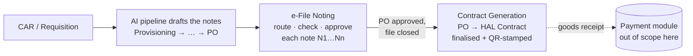

# HAL Procurement Portal — Workflow Guide (post-payment modules)

This guide explains everything built **after** the payment module: what each screen and
button does, where a process starts, and how it flows to the end. It covers three parts:

1. **AI Documents** (`/ai-documents`) — the read-only viewer for AI-drafted procurement notes
2. **e-File Noting** (`/noting/*`) — turning those notes into routable, classified e-files,
   approved stage by stage until the Purchase Order
3. **Contract Generation** (`/contracts/*`) — turning an approved PO into a full HAL contract

The payment module (RV → Payment Advice → HOD → CPPC) is documented separately and is not
covered here.

---

## The big picture

The portal follows the real HAL procurement lifecycle. Each module owns one slice of it:



- The **AI pipeline** (a separate Python program) drafts the standard sequence of
  procurement notes. The web app only **reads** its output.
- **e-File Noting** is where people act: any HAL member initiates a file, routes notes
  member-to-member, raises clarifications, and a competent authority approves or rejects.
  A file is the whole case; it stays open until the **final stage (Purchase Order)** is
  approved, or any note is rejected.
- **Contract Generation** picks up exactly where noting ends: from a PO it assembles the
  contract — standard clauses auto-selected from the Contract Clauses Matrix, prices and
  parties from the PO, scope of work from the Provisioning Note — and finalises it with a
  tamper-evidence hash and QR code.

## Getting started

```bash
npm install
npm run dev        # mock API on :3001, web app on :5173
```

Open http://localhost:5173 and sign in. **All accounts share the password `hal@1234`.**

| Account | Who they are | Use them to demo |
|---|---|---|
| `admin@hal.local` / `test@hal.local` | Admin | Everything + the role-switcher; clause amendment |
| `maker@hal.local` | Asha Mhatre, Purchase Maker | Initiating files, generating contracts |
| `officer@hal.local` | R. Deshpande, Purchase Officer | Routing, Retract demo |
| `hod@hal.local` | V. Rao, HOD (IMM) | Approvals, Retrieve demo |
| `gm@hal.local` | A. K. Sharma, GM (AOD) | Division-wide supervision of files |
| `cm@hal.local` | Gaurav Yadav, CM (Purchase) | Direct-head visibility, top-secret participant |
| `desk@hal.local` | M. Iyer, Payment Desk | Need-to-know share-link recipient |
| `stores@hal.local`, `indentor@hal.local` | Stores / Indentor | Ordinary members |

The top navigation is split into three groups by dividers: the payment screens, **Noting**
(Noting Home · Initiate · Inbox · Files · Cabinet · Reports · Organisation) and
**Contracts** (Generate Contract · Contract Register · Clause Library). Admin accounts see
all of them and get a **role switcher** in the top bar to preview what any role sees.

> Demo data resets: `node server/noting/seed.js` (noting) and
> `node server/contracts/seed.js` (contracts). Restarting the server resets the payment
> mock; the noting and contracts stores are SQLite and survive restarts.

---

# Part 1 — AI Documents (`/ai-documents`)

**What it is:** a read-only window into the AI pipeline's output. If the pipeline has been
run (`python ai/run.py` on the machine), this screen lists every generated note for the
active case; otherwise it shows *"No AI outputs yet — run the pipeline…"*.

**Screen anatomy:**
- **Left sidebar** — one button per generated note, numbered in workflow order
  (01 Provisioning Note, 02 Tender Document, …). Click to select.
- **"Full note" / "New section"** toggle — every AI note is the full prior document plus
  one newly written section. *Full note* shows the whole document; *New section* shows only
  what this stage added. This is the fastest way to explain the pipeline's carry-forward
  design to a viewer.
- **"Download PDF"** — prints just the document (browser Save-as-PDF); everything else on
  screen is excluded from print.

There are no actions here — this screen exists so the drafts can be inspected, and so the
Noting module's Initiate screen can pull a draft in as a starting note.

---

# Part 2 — e-File Noting (`/noting/*`)

## The concepts (worth explaining before any screen)

- **A file is the whole case.** One procurement case = one file (e.g. `AOD/IMM/2026/0001`),
  holding notes **N1…Nn** — one note per workflow stage. Every note carries three connected
  IDs: the **File ID**, a **Reference No** (`<File ID>/N2`), and a globally unique
  **Transaction ID** (`TXN-2026-000004`).
- **The 10 stages** (mirroring the AI pipeline): Provisioning Note → Tender Document →
  EMD Stage Acceptance → TEC Request → TEC Report → Price Bid Opening → PNC Request →
  PNC Recommendation → Purchase Proposal → **Purchase Order + Contract**. Approving an
  intermediate note keeps the file open; approving the **PO** closes it; rejecting any note
  closes it. One **need-based** note exists outside the sequence: **PO Amendment**, offered
  only on a closed PO file (it reopens the file; its own approval closes it again).
- **Custody, not roles.** At any moment exactly one member **holds** the note (the
  custodian) — only they can act on it. Everyone who ever held or routed it is a
  **participant** and can always read it. There are no fixed approval chains: the holder
  chooses the next member freely ("dynamic routing").
- **Classification is graded per note:** Normal (any signed-in member can read) →
  Confidential (participants + any supervising head) → Secret (participants + the direct
  unit/dept head only) → Top Secret (participants + explicit grant only). A bare link or
  transaction ID reveals nothing — access is checked on every read.
- **The cabinet** is each member's personal shelf: once a note is decided, the file lands
  in the cabinets of everyone involved, and that's where the "generate the next stage"
  prompt appears.

## Where to start: Initiate (`/noting/initiate`)

Creates a new file plus its first note (N1). Any HAL member can do this.

1. **Source** — two buttons: **"AI-drafted"** (pick one of the pipeline's generated notes
   from a dropdown; its text is pulled into the draft) or **"Standalone / manual"** (an
   administrative note with no requisition, typed by hand).
2. **File block** — *File title* (required), *Reference type* (MPR / CAR / SPR / CPR /
   Standalone) + reference number, *Classification*, and optionally **"Line-wise child
   of"**: pick an existing parent file plus a *Line / L1 label* to spawn a child Purchase
   Proposal per line item (this builds the parent–child tree shown in Reports).
3. **Note (N1)** — title and body (pipe-delimited rows render as tables in the document view).
4. **"Create & open"** — generates the connected File ID / Reference / Transaction ID, adds
   the Purchase Manual reference attachment automatically, and opens the new note. The note
   starts as a **draft held by you**.

## The workhorse: Note Detail (`/noting/note/<txn-id>`)

Every file link in the app lands here. Top of the screen: the three IDs, classification and
status badges, and **"Currently with …"** — who holds it now. Below that, the action row.
**Which buttons you see depends on whether you hold the note and its status** — this is
the positional access model in action:

| Button | Appears when | What it does |
|---|---|---|
| **Edit draft** | you hold it, status Draft | edit title / classification / body, **Save draft** |
| **Send for check** | you hold it, status Draft | route it to a checker before formal routing |
| **Forward** | you hold it (draft or routed) | pick any member (grouped Dept › Section — including yourself, or someone twice) + comment. An empty or symbols-only comment becomes **"Concurred & Forwarded"** automatically |
| **Send back** | you hold a routed note | return it — the picker lists **only** the initiator and prior holders |
| **Approve / Reject** | you hold a routed note | record the decision + optional remark: **"Approve & file"** / **"Reject & file"**. A draft can never be decided (no self-approval of an unrouted note) |
| **Retract** | you sent the last hop and the recipient **has not opened it yet** | pulls the note back instantly; opening locks it |
| **Retrieve from cabinet** | note is decided and **you** decided it | reopens the decision (undo for the decider) |
| **Share (need-to-know)** | note is classified above Normal | issue a personal access link for one member — see below |
| **Summary** | always | a generated condensed summary of the proposal |
| **Download PDF** | always | prints the note document only |

Below the actions: **Attachments** (typed — anyone routed can add a *Reference/document*;
only the initiator may add a *Stamping document* or *DoP reference*; the *PM reference* is
attached automatically and can't be added by hand), the **Routing trail** (every hop with
who → whom, comment, date, and flags like *"Awaiting — not yet opened"*), and
**Clarifications** (below).

### The normal life of a note, end to end

1. Maker **initiates** N1 (draft, held by maker).
2. Maker **sends for check** or **forwards** to the officer — the note appears in the
   officer's **Inbox** tagged *"To check"* / *"To act"*.
3. The officer opens it (this locks retraction), reads, maybe raises a **clarification**,
   attaches documents, then **forwards** to the HOD — or **sends back** for rework.
4. The HOD **approves**. The note closes; the file goes to the **cabinet** of everyone
   involved.
5. In the cabinet, the file's row now shows **"Generate EMD Stage Acceptance"** (or
   whatever the next stage is). One click creates N2 as a connected draft and the cycle
   repeats — through all ten stages.
6. Approving the **Purchase Order** note closes the file for good. The cabinet then offers
   exactly one thing: **"Generate PO Amendment"** (need-based; reopens the file until the
   amendment is itself approved). A rejected file offers nothing.

### Clarifications — the private side-channel

On any note, a participant can **Raise** a question to another participant. The thread is
strictly two-party: only the asker, the person asked (and the note's initiator) see it —
other members routed on the same note do not. Replies via the **Send** button; the thread
shows **Open**/**Answered** status. Use this to demo "query without routing the file back".

### Classification & need-to-know sharing

On a Confidential/Secret/Top-Secret note, the holder can **Share (need-to-know)**: pick a
member, **Issue link**, and give them the generated URL — access is bound to *that member*,
not the link. If the recipient forwards the link and someone else opens it, the grant is
**revoked for both** and the custodian sees a ⚠ **leak alert** on the note. This is the
anti-leak story: a link or transaction ID alone grants nothing, anywhere — including in
the Files list and all reports, which show each person only what they may see.

## The other noting screens

- **Inbox** (`/noting/inbox`) — notes currently waiting **with you**, each tagged with why:
  *To check*, *To act*, or *To decide*. Click the reference to open and act.
- **Files** (`/noting/files`) — the file browser (+ an **"+ Initiate Note"** shortcut). You
  only see files with at least one note you're allowed to read; status/classification shown
  are of the latest note *visible to you*.
- **Cabinet** (`/noting/cabinet`) — your decided/closed files with your role in each
  (Initiator / Router / Approver) and the **"Generate …"** next-action button described above.
- **Reports** (`/noting/reports`) — four tabs, each scoped to what you may see (own files,
  plus your subtree if you head a unit): **Lifecycle summary** (stage, status, note and
  PO-amendment counts, elapsed days), **Stage & time** (per-note durations), **Parent–child
  tree** (case → line-wise child PPs), **Live status** (days since provisioning/tendering
  started). Heads' visibility is **tenure-aware**: a sitting head sees their whole subtree's
  history; a former head only files from their own tenure window.
- **Organisation** (`/noting/org`) — the seeded HAL tree (Corporate › Complex › Division ›
  Department › Section) and the member directory. Useful to explain *positional* access.

## Seeded noting demos — what to show with which login

| Demo | How |
|---|---|
| Multi-note lifecycle prompt | `maker@` → Cabinet → NVB file shows **"Generate EMD Stage Acceptance"** |
| PO Amendment on a closed file | `maker@` → Cabinet → "Procurement of hydraulic seals" shows **"Generate PO Amendment"** |
| Retract an unopened hop | `officer@` → open the office-furniture note → **Retract** |
| Retrieve after decision | `hod@` → open the rejected tool-kits note → **Retrieve from cabinet** |
| Confidential + share link | `desk@` → open the secure-comms note with `?grant=demo-grant-active-desk`; `officer@` sees the revoked re-share **leak alert** on the same note |
| Top Secret isolation | `hod@` cannot see the special-project file at all; `maker@`/`cm@` can |
| Tenure supervision | `gm@` sees every IMM file incl. the 2023 predecessor-era case |
| Clarifications | NVB child PP (Line 1) has an answered and an open thread |

---

# Part 3 — Contract Generation (`/contracts/*`)

## The concepts

- **The STC library**: the 72 **Standard Contract Terms & Conditions** clauses (from the
  legal cell's clause documents) live in the portal, versioned. General users can read them;
  **only an admin can amend them**, and every amendment records the superseded text, who
  changed it, a change note, and the legal-vetting **reference doc**.
- **The Contract Clauses Matrix** maps all 71 matrix clauses × 8 contract types (four
  Supply categories, Transfer of Technology, Services/MRO, Long-Term Business Agreements,
  Licence Agreements). Each cell is *Y* (auto-include), *N* (excluded), *TBD*, or a
  condition ("Need to include on case-to-case basis…"). Choosing the type of contract
  **auto-crawls** the clause set from this matrix.
- **Snapshots**: when a contract is generated, the clause texts and the PO's item prices
  are frozen into it. Amending the library later never changes an existing contract.
- **Classification** (contract-level, five grades): Normal, Restricted, Confidential,
  Secret, Top Secret — shown as a badge in the register and as the **watermark** on the
  printed document.
- All money (GST per line, tax totals, final landed value) is computed by the server from
  the PO's raw item lines — the screen never calculates anything.

## Where to start: Generate Contract (`/contracts/generate`)

One progressive form, top to bottom — later sections appear as earlier ones are filled:

1. **Tender & Purchase Order.** Type the **Requisition / HAL IFS tender no** (suggestions
   appear as you type — try `GEM/2025/B/6638737`). The app resolves the tender and shows its
   CAR, mode of tendering and CFA/DOP reference — then **prompts for which PO** to generate
   from in a dropdown. (`GEM/2025/B/7104412` has **two** POs under it — the moment to show
   that one tender can yield several contracts.)
2. **Fetched from HAL PO (read-only).** The supplier card (name, address, GSTIN, contact),
   the PO header, the full **item table** — part no, HSN, qty, UOM, unit price, GST — with
   server-computed tax and landed value, and the **scope of work from the Provisioning
   Note** (expandable).
3. **Type of purchase/contract & standard clauses.** Pick one of the 8 types (pre-filled
   with a suggestion). The clause plan appears instantly: **Auto-selected (per Matrix)** —
   checked and locked; **Offered — include on requirement** — tickable, each showing the
   matrix's own condition text verbatim; and a collapsed list of clauses marked *N* for
   this type (still tickable — the user may add any extra STC beyond the matrix).
4. **Contract particulars.** Classification, description (pre-filled from the PO), period
   from/to, validity.
5. **Additional clauses (user-written).** **"+ Add additional clause"** → title + text
   rows. These print under a separate **"Additional Clauses"** heading, numbered AC-1, AC-2…
6. **Standard proformas to annex.** Tick any of the ~12 HAL standard formats (PBG bank
   guarantee, Integrity Pact, NDA, MII declaration, …) — each becomes a named annexure.

**"Generate Contract"** creates the contract as a **draft** and opens it. The contract
number is generated automatically and references the PO: `HAL/AOD/CTR/<FY>/<PO-serial>/<NN>`.
The generator's name, PB no, designation, department and division are stamped from the
signed-in user — never typed in.

## The contract view (`/contracts/view/<id>`)

The printed document plus an action bar. The document always shows:

- **Cover page** — contract no, date, description, both parties (HAL AOD Nashik ↔ the
  supplier with address/GSTIN/contact), value in figures **and words**, period, validity,
  type, and the PO / tender / CAR / CFA-DOP references.
- **Table of Contents / Index** — every clause and annexure in order.
- The numbered **standard clauses**, then **Additional Clauses**.
- **Annexure A — Schedule of Items & Prices**: the PO's line items with HSN, qty, UOM, unit
  price, tax % (CGST/SGST shown as the half-split, IGST as one levy), tax amount, line
  total — and Total Basic / Total Tax / **Final Landed Value** with amount in words.
- **Annexure B — Scope of Work & Technical Specifications** (Provisioning Note + tender doc).
- One annexure per ticked proforma, then the **signature block** and the QR panel.

**While a draft:**
- **"Edit selections"** — change classification, description, period/validity, ticked
  extra clauses, additional clauses, annexed proformas, and the **"Encrypt for Smart
  Contract"** toggle. The auto clause set and the PO's items are deliberately not editable.
- **"Finalise & stamp"** — the point of no return (a confirmation explains this). The
  server locks the content, computes its **SHA-256 integrity hash**, and stamps date-time +
  signer credentials into a **scannable QR code** on the document. If the smart-contract
  toggle was on, the hash is anchored to a **clearly-labelled simulated blockchain** (demo
  stub — say so when presenting).

**Once finalised:**
- **"Verify integrity"** — recomputes the hash from what is stored and compares: green
  banner if untouched, red **INTEGRITY FAILURE** if anything was altered after
  finalisation. (Scanning the QR with a phone shows the same contract no + hash + stamp +
  signer.)
- **"Download PDF"** — browser print of the document alone. The printout carries the
  classification **watermark** on every page and a running footer with the contract no and
  hash prefix. Turn on *"Headers and footers"* in the print dialog for page numbers —
  per-clause TOC page numbers are a browser-print limitation, flagged to the client.
- Editing is refused from here on — drafts only.

## Contract Register (`/contracts/register`)

Every contract ever generated, filterable **All / Draft / Finalised**, with number,
generation date, description, supplier, type, value, validity, PO, tender, CAR,
classification, status and *who generated it*. **"Export CSV"** downloads the full field
list the client specified — including CFA & DOP reference, mode of tendering, party
addresses/contacts, and the generator's PB/designation/dept/division. Click a contract no
to open it.

## Clause Library (`/contracts/library`)

Two tabs:

- **Clauses** — all 72 STC with clause no, boilerplate flag, current version and last-amended
  date. Click a title to open the drawer: the full legal text, the guideline/circular
  reference from the matrix, and the **amendment history** (superseded version, date,
  person, change note, reference doc). Non-admins see a lock notice — read-only.
- **Matrix** — the full 71 × 8 grid, colour-coded: green **Y**, red **N**, amber **TBD**,
  blue **Cond.** (hover for the full condition text). This is the artefact that drives the
  auto-crawl on the Generate screen.

**Amending a clause (admin only):** open a clause → **"Amend clause"** → edit the text and
fill the **change note** and **reference doc for change** (both mandatory — the "after due
legal vetting" rule) → **"Save amendment"**. The version bumps, the old text goes into
history — and any already-generated contract keeps its original snapshot (open one to
prove it). A non-admin pressing the same button gets a server refusal — the check is on the
real signed-in account, so even the admin role-switcher preview can't bypass it.

## Seeded contract demos

| Demo | How |
|---|---|
| Finalised contract with QR + smart-sim | Register → `HAL/AOD/CTR/…/0533/01` (NVB, **Restricted** watermark, simulated blockchain banner) — scan the QR, press **Verify integrity** |
| Draft → finalise flow | Register → the seating draft (`…/0457/01`) → **Edit selections** → **Finalise & stamp** |
| PO dropdown moment | Generate → tender `GEM/2025/B/7104412` (two POs) |
| Non-GeM IFS tender | Generate → `IFS/AOD/25-26/RM-044` (raw material, 3 line items) |
| Versioned clause history | Library → *Liquidated Damages* — already at v2 with the legal-vetting reference |
| Admin-only amendment | Amend any clause as `admin@`; retry as `maker@` to show the refusal |

---

## Suggested 15-minute demo order

1. **Login as `maker@`** → AI Documents: show a generated note, Full vs New section. (2 min)
2. **Noting**: Initiate an AI-drafted N1 → Forward to `officer@` → switch login → Inbox →
   open (mention retraction just got locked) → Forward to `hod@` → switch → **Approve &
   file** → back as `maker@` → Cabinet → **Generate** the next stage. (5 min)
3. **Classification**: as `desk@`, open the confidential note via its grant link; as
   `officer@`, show the leak alert. (2 min)
4. **Contracts**: as `maker@`, Generate with `GEM/2025/B/7104412` → pick a PO → walk the
   auto/offered clauses → add a custom clause → Generate → **Finalise & stamp** → scan the
   QR → **Verify integrity** → print with the watermark. (5 min)
5. **Clause Library** as `admin@`: amend a clause with a reference doc, reopen the old
   contract — unchanged. (1 min)
