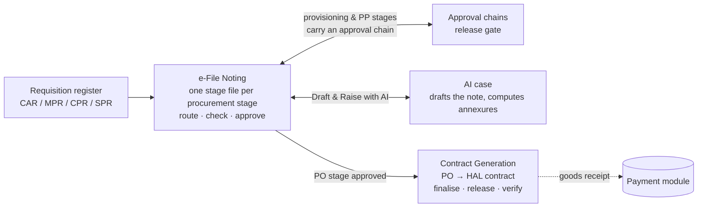

# HAL Procurement Portal — Workflow Guide (noting and contracts)

This guide explains, screen by screen and button by button, the three modules that sit
between the requisition and the payment:

1. **AI Documents** (`/noting/ai-documents`) — the read-only viewer for the Python CLI's notes
2. **e-File Noting** (`/noting/*`) — stage files, routing, custody, classification,
   clarifications, delegation, and the approval-chain and AI-case links
3. **Contract Generation** (`/contracts/*`) — turning an approved PO into a HAL contract,
   finalising, releasing and verifying it

The requisition register, approval chains, AI cases, payment, claims and KPIs are covered
in `USER_GUIDE.md`, which also walks the integrated storyline.

---

## The big picture


```mermaid
flowchart LR
  G[Requisition register<br/>CAR / MPR / CPR / SPR] --> C[e-File Noting<br/>one stage file per procurement stage<br/>route · check · approve]
  C <-->|provisioning & PP stages<br/>carry an approval chain| E[Approval chains<br/>release gate]
  C <-->|Draft & Raise with AI| F[AI case<br/>drafts the note, computes annexures]
  C -->|PO stage approved| D[Contract Generation<br/>PO → HAL contract<br/>finalise · release · verify]
  D -.->|goods receipt| A[(Payment module)]
```

- **Noting is where people act**: a proposal is a chain of stage files, each routed
  member-to-member and decided by its planned authority.
- **The AI case drafts the text** of a stage when the holder asks for it; the note is stored
  on the stage file with its annexures as computed attachments.
- **The approval chain gates** the provisioning and purchase-proposal stages: they cannot be
  approved until the chain is released.
- **Contracts pick up at the PO.** The "PP approved" queue lists what is ready; the contract
  is generated from the PO fixture and the clause matrix, finalised with a hash and QR,
  released to IFS (recorded, no connector) and verifiable afterwards.

## Getting started

```bash
npm install
npm run dev        # API on :3001, web app on :5173
```

Open http://localhost:5173 and sign in. **All accounts share the password `hal@1234`.**

| Account | Noting member | Use them to demo |
|---|---|---|
| `admin@hal.local` / `test@hal.local` | Administrator / QA Test | Everything + the role switcher; clause amendment; contract decrypt |
| `indentor@hal.local` | Indent Cell | Requisitions, provisioning stage files, hand-over to tendering |
| `maker@hal.local` | Asha Mhatre, Purchase Maker | Tender-stage files, AI drafting, generating contracts |
| `officer@hal.local` | R. Deshpande, Purchase Officer | Routing, Retract demo, contract release and verify |
| `hod@hal.local` | V. Rao, HOD (IMM) | Approvals, Retrieve demo, delegation |
| `gm@hal.local` | A. K. Sharma, GM (AOD) | Division-wide supervision of files |
| `cm@hal.local` | Gaurav Yadav, CM (Purchase) | Tender initiator; direct-head visibility, top-secret participant |
| `desk@hal.local` | M. Iyer, Payment Desk | Need-to-know share-link recipient |
| `stores@hal.local`, `cppc@hal.local` | Stores / CPPC | Ordinary members |

The top bar carries a **module switcher** and, under it, the screens of the current module.
Noting shows Noting Home · Inbox · SentBox · Cabinet · + Create E-File · Drafts & Files ·
Upcoming · Reports · Organisation · AI Documents; Contracts shows Contract Register ·
Generate Contract · 72 STC Clause Library. Admin accounts get the role switcher, which
previews what a role sees and never changes what the server allows.

> Demo data resets: `node server/noting/seed.js` (noting) and `node server/contracts/seed.js`
> (contracts). Restarting the server resets the payment and claims stores; every other store
> is SQLite and survives restarts.

---

# Part 1 — AI Documents (`/noting/ai-documents`)

**What it is:** a read-only window into the Python pipeline's output. If the pipeline has
been run (`python ai/run.py --auto`), this screen lists every generated note for the active
case; otherwise it shows *"No AI outputs yet — run the pipeline…"*.

- **Left sidebar** — one button per generated note, in workflow order.
- **"Full note" / "New section"** — every AI note is the full prior document plus one newly
  written section. This toggle is the fastest way to explain carry-forward to a viewer.
- **"Download PDF"** — prints just the document.

There are no actions here. The live equivalent, where notes are generated in the browser,
is **AI Cases** (`/ai-cases`) and the **Draft & Raise with AI →** button on a stage file.

---

# Part 2 — e-File Noting (`/noting/*`)

## The concepts

- **A proposal is a chain of separate stage files.** One procurement case (one MPR/CAR, File
  ID e.g. `AOD/IMM/2026/0001`) is carried by stage files: Provisioning, EMD Stage Acceptance,
  TEC Request, TEC Report, Price Bid Opening, PNC Request, PNC Recommendation, Purchase
  Proposal, **Purchase Order + Contract**, plus need-based ones — Retender, Short Closure,
  TEC Query, Advance Payment, PO Amendment, and the off-cascade TEC Representation, Bank
  Detail Insertion, Vendor ID Creation, Vendor Registration, Tender Due Date Extension,
  Addendum / Corrigendum and Misc. Each stage file has its own routing trail and its own
  minutes **N1…Nx**, and three connected IDs: the **File ID**, a **Reference No**
  (`<File ID>/S2`) and a **Transaction ID** (`TXN-2026-000004`).
- **A proposal is anchored to a requisition.** Starting from the register (or
  `/noting/initiate?requisition=`) locks the requisition into the file; a cascade stage other
  than Provisioning can never start a new file — it is added to its proposal from the cabinet.
- **What may follow a stage** comes from the responsibility-cascade sheet: an approved
  Provisioning offers EMD, TEC Request or Retender; an approved TEC Report offers Price Bid
  Opening, Retender or Short Closure; and so on. You can also **skip to another stage**.
  Approving the **PO** closes the proposal; rejecting any stage closes it. **PO Amendment**
  is offered only on a closed PO proposal.
- **Hand-over to tendering.** An approved Provisioning rests in its initiator's cabinet. The
  initiator presses **Send to Tender Initiator** and picks the member who will float the
  tender. Tender stages cannot be generated before this hand-over.
- **Custody, not roles.** Exactly one member **holds** a note — the custodian — and only they
  can act on it, or a member holding an **active delegation** from them (the hop is stamped
  *on behalf of*). Everyone who ever held or routed it is a **participant** and can always
  read it.
- **Planned routing.** The initiator sets the routing plan and the approving authority when
  the file is created. Each **Forward** is checked against the plan; the holder may deviate,
  but only with a reason, which is written into the minutes.
- **Authority.** Only the planned approver (or their delegate) decides a stage. A draft can
  never be decided. Provisioning and Purchase Proposal stages also carry an **approval chain**
  (Module E, `server/noting/approvalPolicy.json`): approving the stage is refused with 409
  until that chain is released.
- **Classification is graded per note:** normal (any signed-in member can read) →
  restricted / confidential / secret / top secret (participants, the proposal's owners and
  explicit grantees only — there is no head bypass above normal). A bare link or transaction
  ID reveals nothing; access is checked on every read.
- **The cabinet** is each member's shelf of decided stage files, each row carrying the
  proposal's progress (S1 → S2 → …), its current stage and holder, and the next action.

## Where to start: Initiate (`/noting/initiate`)

A four-step wizard. Three entry points share it: plain `/noting/initiate` (a new proposal),
`?requisition=<id>` from the register (the requisition is locked in), and `?stage=<id>` from
the Portal Hub's note items (a cascade stage is added to the proposal you pick; an
off-cascade need-based note may open a file of its own).

1. **Source & file** — **AI-drafted (Pipeline)** (pick the NVB or the fabricated LED case;
   the pipeline's provisioning note seeds N1) or **Standalone / manual**. File title,
   reference kind and number, classification, priority, optionally **Line-wise child of** a
   parent file. **Next: Routing →**
2. **Routing** — **+ Add Member to Routing** builds the planned trail; the last member is the
   approving authority. **Next: Notesheet →**
3. **Notesheet** — the N1 body in the rich-text editor (pipe-delimited rows render as tables).
   **Next: Cover Page →**
4. **Cover page** — **+ Select DOP Matrix** (a row from `ai/dop2025.json`, filed as a DoP
   attachment), **+ Configure Stamping** (stamping setup plus its PDF), files to attach.
   **Review & Submit E-File →** opens the final review, which asks for the **6-digit
   one-time password** (**Get demo code** fetches it) — **SUBMIT E-FILE**.

Everything collected is posted: the plan, approver, priority, OTP (verified server-side and
stamped on the note), DoP row, stamping PDF and files as typed attachments. The note starts
as a **draft held by you**; for a provisioning stage its approval chain is created at once.

## The workhorse: Note Detail (`/noting/note/<txn-id>`)

Top of the screen: the three IDs, classification and status badges, **"Currently with …"**,
the current-stage / tender-initiator strip, and for chained stages an **Approval chain #n**
banner (hops recorded, released or what blocks it, positions still to be named) linking to
the chain. Below that, the action row. **Which buttons you see depends on whether you hold
the note and its status:**

| Button | Appears when | What it does |
|---|---|---|
| **Edit** / **Save Draft** | you hold it, status Draft | edit title / classification / body |
| **Send for Check** | you hold it, status Draft | route it to a checker before formal routing |
| **Forward to Officer →** | you hold it | pick the next member (the plan's next hop is proposed; deviating needs a reason) + comment. An empty or symbols-only comment becomes **"Concurred & Forwarded"** |
| **← Send Back** | you hold a routed note | return it — the picker lists **only** the initiator and prior holders |
| **Approve & File** / **Reject & Close** | you are the planned authority and hold it | records the decision; refused for a draft, and with 409 while the stage's approval chain is not released. Rejecting an AI-sourced stage rolls the AI case back |
| **Retract Hop** | you sent the last hop and the recipient has not opened it | pulls the note back; opening locks it |
| **Retrieve from Cabinet** | note is decided and **you** decided it | reopens the decision |
| **Share (Need-to-Know)** | note is classified above normal | issue a personal access link for one member |
| **+ Add Noting Minute (N n)** | you hold it | append the next minute |
| **Draft & Raise with AI →** | you hold a decided stage whose next notes the cascade allows | see *AI link* below |
| **Link AI case** / **Move to Agency** | file has no case / the case's custody must move | link a Module F case; hand it across |
| **Formats on File (n)** | always | the standard formats attached to this proposal |
| **Proposal Summary** / **Download PDF** | always | a deterministic condensed summary; print the note only |

Below the actions, four accordions: **AI Cascade: Next Notes**, **Routing Trail** (every hop
with who → whom, comment, date, *on behalf of*, and *"Awaiting — not yet opened"*),
**Attachments** and **Clarifications**, plus **Need-to-Know Grants** on classified notes.

**Attachments** are typed: anyone routed may add a *Reference / Document* (a real upload);
only the initiator a *Stamping document* or *DoP reference*; the *PM reference* is attached
automatically. Two kinds carry no file: **AI Annexure** (computed by the pipeline, viewed as
a field table) and **Standard Format** — pick one from the library, **Render & attach**, and
the server renders it from the linked requisition and files it as blocks (**View**, print).

**AI link.** The first AI-sourced minute renders as a document (pipe rows become tables).
**Draft & Raise with AI →** opens the note's pre-filled form; **Raise Anyway (Record
Advisory Override)** appears when a rule advises against the choice. The next stage file is
created on the noting side and the case advances together; if the case fails, nothing is
created.

### The normal life of a note, end to end

1. Indentor **initiates** the Provisioning stage from the requisition (draft, held by them);
   its approval chain is planned.
2. **Forward to Officer →** — the note appears in the officer's **Inbox** with days waiting,
   priority and *To check* / *To act*. Opening it locks retraction.
3. The officer reads, maybe raises a **clarification**, attaches documents, then forwards to
   the HOD per the plan — or **← Send Back** for rework.
4. The chain runs in Approvals; once released the HOD's **Approve & File** succeeds. The
   stage closes and rests in the **cabinet** of everyone involved.
5. The initiator presses **Send to Tender Initiator** and picks Gaurav Yadav (`cm@`).
6. The tender initiator's cabinet row offers **Generate EMD Stage Acceptance Note**,
   **Generate TEC Request Note**, **Generate Retender Note** and **Skip to another stage…**.
   Generating one opens a fresh stage file (S2) at N1 with its own routing trail; **Draft &
   Raise with AI →** drafts its text.
7. The Purchase Proposal stage carries its own chain; approving it makes the requisition
   **PP approved** and puts it on the contracts queue.
8. Approving the **Purchase Order** stage closes the proposal. The cabinet then offers only
   **Generate PO Amendment**. A rejected stage closes the proposal and offers nothing.

### Delegation

Inbox → **Delegate Authority**: from/to dates, the officiating member, reasons, **Delegate**.
While active, the delegate sees the delegator's notes in **DELEGATED INBOX** and may act on
them; every such hop is stamped *on behalf of*. Delegations you gave and hold are listed with
**Cancel**.

### Clarifications — the private side-channel

On any note, a participant can **Raise** a question to another participant. The thread is
strictly two-party: only the asker and the person asked see it. Replies via **Send**; the
thread shows **Open** / **Answered**. The Inbox column counts *open / total* per note.

### Classification & need-to-know sharing

On a note above normal, the holder can **Share (Need-to-Know)**: pick a member, issue the
link, give it to them — access is bound to *that member*. If the recipient forwards the link
and someone else opens it, the grant is **revoked for both** and the custodian sees a ⚠
**leak alert**. Files, cabinets and reports show each person only what they may see.

## The other noting screens

- **Noting Home** — your workload over the last six months, rate of clearance and the e-file
  trend, computed from the store.
- **Inbox** — what waits with you: days waiting, reference, sender, subject, department,
  received date, priority, action, status, class, clarifications, file id; the DELEGATED tab
  and the delegation panel.
- **SentBox** / **Upcoming** — what you sent and where it is; files whose plan reaches you
  later.
- **Drafts & Files** — the file browser (+ **Initiate**). You see a file if at least one of
  its notes is visible to you; the stage, status, holder and classification shown are of the
  latest stage *visible to you*.
- **Cabinet** — your decided stage files with your role in each, the proposal's progress, the
  filters (All / Proposal Open / Proposal Closed, Approved / Rejected), **📜 History
  (N1..Nx)**, and the **Send to Tender Initiator** / **Generate …** / **Skip to another
  stage…** actions.
- **Reports** — Lifecycle summary, Stage & time, Parent–child tree, Live status; each scoped
  to what you may see. Heads' visibility is **tenure-aware**.
- **Organisation** — the seeded HAL tree and member directory.

## Seeded noting demos

| Demo | How |
|---|---|
| Requisition → file | `indentor@` → Provisioning → a requisition without a file → **Initiate note** |
| Chain gate | `hod@` → Inbox → a provisioning stage → **Approve & File** while its chain is open → 409 naming the chain |
| Hand-over to tendering | `indentor@` → Cabinet → "Procurement of hydraulic test rig spares" → **Send to Tender Initiator** → Gaurav Yadav; then `cm@` → Cabinet → **Generate EMD / TEC Request / Retender** |
| Next stage from the cascade | `cm@` or `maker@` → Cabinet → NVB **S2 EMD** row → **Generate TEC Request Note / Retender Note / Short Closure Note** |
| PO Amendment on a closed file | `maker@` → Cabinet → "Procurement of hydraulic seals" → **Generate PO Amendment** |
| Retract an unopened hop | `officer@` → the office-furniture note → **Retract Hop** |
| Retrieve after decision | `hod@` → the rejected tool-kits note → **Retrieve from Cabinet** |
| Delegation | `hod@` → Inbox → **Delegate Authority** → `cm@`; sign in as `cm@` → DELEGATED INBOX |
| Confidential + share link | `desk@` opens the secure-comms note with `?grant=demo-grant-active-desk`; `officer@` sees the revoked re-share **leak alert** |
| Top Secret isolation | `hod@` cannot see the special-project file; `maker@` / `cm@` can |
| Tenure supervision | `gm@` sees every IMM file incl. the 2023 predecessor-era case |
| Clarifications | NVB child PP (Line 1) has an answered and an open thread |
| Formats on file | any holder → Attachments → pick a format → **Render & attach** → **View** |

---

# Part 3 — Contract Generation (`/contracts/*`)

## The concepts

- **The STC library**: the 72 **Standard Contract Terms & Conditions** clauses live in the
  portal, versioned. Anyone can read them; **only an admin account can amend them**, and
  every amendment records the superseded text, the person, a change note and the
  legal-vetting **reference doc**.
- **The Contract Clauses Matrix** maps 71 matrix clauses × 8 contract types. Each cell is
  *Y* (auto), *N* (excluded, still tickable), *TBD* or a condition (offered). Choosing the
  contract type **auto-crawls** the clause set.
- **Snapshots**: clause texts, the PO's item prices and the rendered annexed formats are
  frozen into the contract at generation. Amending the library later never changes it.
- **Status**: `draft → finalised → released`. Every edit, finalisation, release and
  verification is written to the contract's **audit trail**.
- **Classification** (five grades) is a badge and the print **watermark**; it does not gate
  access on contracts.
- All money (GST per line, totals, landed value) is computed by the server.

## Where to start: PP approved list and Generate Contract

**CON-01 — PP approved list** (`/contracts/register?filter=approved_pp`) lists the
requisitions whose Purchase Proposal is approved with a released chain and no contract yet.
Each row opens **Generate Contract** with the tender, PO and requisition pre-filled.

**Generate Contract** (`/contracts/generate`), top to bottom:

1. **Tender & Purchase Order.** Type the tender no (try `GEM/2025/B/6638737`); the app
   resolves the tender and prompts for the PO. `GEM/2025/B/7104412` has **two** POs.
2. **Fetched from HAL PO (read-only)** — supplier card, PO header, item table with
   server-computed tax and landed value, the scope of work.
3. **Type of contract & standard clauses** — auto-selected (locked), offered (tickable, with
   the matrix's condition verbatim) and the collapsed *clauses marked N for this type*.
4. **Contract particulars** — classification, description, period, validity.
5. **Additional clauses** — **+ Add additional clause**, printed as AC-1, AC-2…
6. **Standard formats to annex** — tick any library format (PBG, SD, NDA, integrity pact…);
   each is rendered from the PO and frozen as a named annexure.

**Generate Contract** creates a **draft** numbered `HAL/AOD/CTR/<FY>/<PO-serial>/<NN>`. The
generator's identity is stamped from the signed-in user.

## The contract view (`/contracts/view/<id>`)

The document (cover page, index, clauses, additional clauses, Annexure A price schedule with
amount in words, Annexure B scope, one annexure per format, signature block and QR) plus the
action bar and the audit trail.

**While a draft:** **Edit selections** (classification, description, period, ticked extras,
additional clauses, annexed formats, the **Encrypt for Smart Contract** toggle; the auto set
and the items are not editable) and **Finalise & stamp** — the point of no return. The server
computes the **SHA-256 integrity hash**, stamps the QR payload, and with the toggle on
anchors the hash to a **clearly labelled simulated ledger** and encrypts the canonical
payload — with the built-in **demo key** unless `CONTRACT_ENCRYPTION_KEY` is set.

**Once finalised:**

- **Release to IFS** (purchase chain) — records the release, optionally with the GeM
  contract number; status `released`. There is no connector in the prototype.
- **Verify integrity** — recomputes the hash and the simulated anchor: green if untouched,
  red **INTEGRITY FAILURE** or **SIMULATED ANCHOR MISMATCH** otherwise, and it names the key
  source (*CONTRACT_ENCRYPTION_KEY* or *built-in DEMO key*).
- **Decrypt (admin, demo)** — decrypts the stored payload and confirms its hash matches.
- **Download PDF** — browser print with the watermark and running footer. Per-clause TOC
  page numbers are a browser-print limitation.

## Contract Register (`/contracts/register`)

Filters **All contracts / PP approved — awaiting contract / Draft / Finalised / Released**;
columns include the CAR (linking to the requisition), PO, tender, value, classification,
status and generator. **Export CSV** downloads the full field list. Click a contract no to
open it.

## Clause Library (`/contracts/library`)

**Clauses** — all 72 STC with version and history drawer. **Matrix** — the 71 × 8 grid,
colour-coded. **Amend Clause** is enabled only for admin accounts (the tooltip says so for
everyone else, and the server checks the real account, not the role-switcher preview):
edit the text, fill the **change note** and **reference doc** (both mandatory) → **Save
amendment**. The version bumps, the old text goes into history, and existing contracts keep
their snapshot.

## Seeded contract demos

| Demo | How |
|---|---|
| Finalised NVB contract | Register → `HAL/AOD/CTR/…/0533/01` (**Restricted** watermark, simulated ledger banner, linked to `CAR/25/229`) → **Verify integrity** → `officer@` **Release to IFS** |
| Draft → finalise | Register → the seating draft (`…/0457/01`) → **Edit selections** → **Finalise & stamp** |
| PP approved queue | Register → **PP approved — awaiting contract** |
| PO dropdown moment | Generate → tender `GEM/2025/B/7104412` (two POs) |
| Non-GeM IFS tender | Generate → `IFS/AOD/25-26/RM-044` |
| Versioned clause history | Library → *Liquidated Damages* — at v2 with the legal-vetting reference |
| Admin-only amendment | Amend as `admin@`; as `maker@` the button is disabled and the server refuses |
| Decrypt round trip | `admin@` → the NVB contract → **Decrypt (admin, demo)** |

---

## Suggested 15-minute demo order

1. **`indentor@`** — Provisioning → `CAR/25/229` → its file; Approvals → the chain. (2 min)
2. **Noting** — `hod@` tries **Approve & File** on an open chain (409); release the chain;
   approve; `indentor@` **Send to Tender Initiator**; `cm@` **Generate EMD** → **Draft &
   Raise with AI →**. (5 min)
3. **Classification** — `desk@` opens the confidential note via its grant link; `officer@`
   shows the leak alert. (2 min)
4. **Contracts** — `maker@` → PP approved list → Generate → **Finalise & stamp**; `officer@`
   → **Release to IFS** → **Verify integrity**; print with the watermark. (5 min)
5. **Clause Library** as `admin@` — amend a clause; reopen the contract, unchanged. (1 min)
