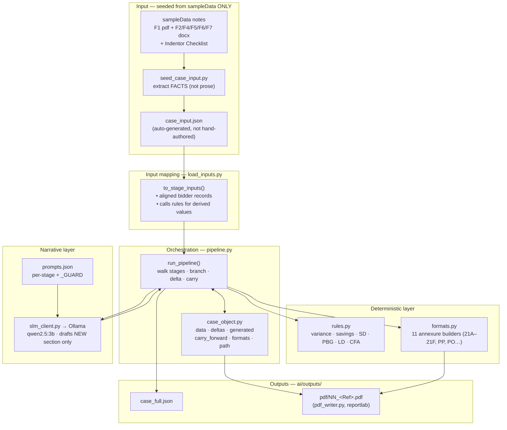
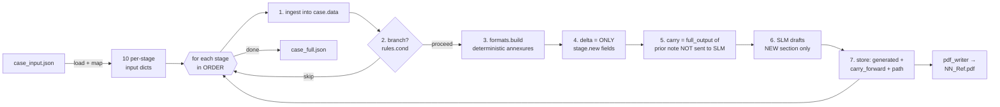
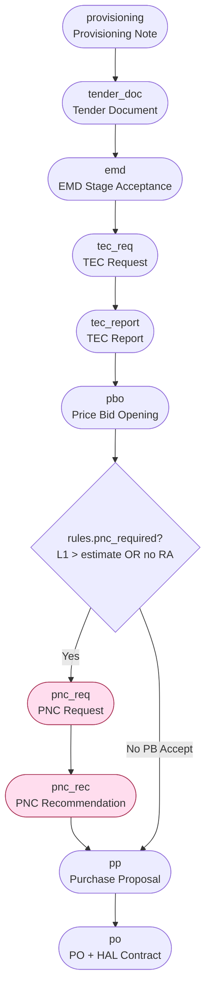
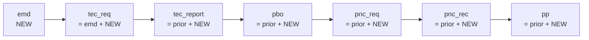
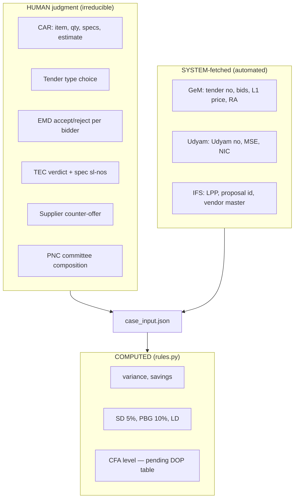

# HAL Procurement Noting — Module B (AI/Automation) Design

## Quickstart — How to Run (Ollama)

Run everything from the repo root (`HAL_Procurement_Portal/`). Python deps live in the **`hal` conda env**; the SLM is a **local Ollama** model.

1. **Start Ollama and pull the model** (the pull is one-time):
   ```bash
   ollama serve                  # skip if already running (port 11434 in use)
   ollama pull qwen2.5:3b        # the model tools/slm_client.py expects
   ```
2. **Install Python deps into the `hal` env** (one-time):
   ```bash
   conda run -n hal pip install pymupdf python-docx requests reportlab openpyxl
   ```
3. **Run the pipeline — interactively (default on a terminal):**
   ```bash
   conda run --no-capture-output -n hal python ai/run.py
   ```
   Walks the **responsibility cascade** one decision at a time: at every stage it offers only
   the notes that stage allows, enforces which of the two agencies (Indenting / Tendering) may
   raise them, and generates whichever note you pick. See [CASCADE.md](CASCADE.md) for the flow
   diagram and every condition. `--no-capture-output` is needed because plain `conda run`
   buffers stdio and the prompts never appear; `conda activate hal && python ai/run.py` also works.

   **Unattended full-graph run** (the original behaviour — also the automatic fallback when
   stdin is not a terminal, so scripts and CI are unaffected):
   ```bash
   conda run --no-capture-output -n hal python ai/run.py --auto
   ```
   Reads `ai/case_input.json` → walks the 10-stage ORDER → SLM drafts each new section → writes `ai/outputs/`.
4. **Inspect outputs** (`ai/outputs/`, gitignored):
   - `case_full.json` — full case object (data, deltas, generated, carry_forward, formats, path, skipped)
   - `pdf/NN_<Ref>.pdf` — one HAL house-style PDF per executed note
5. **(Optional) Score the run** against gold facts from `sampleData/`:
   ```bash
   conda run -n hal python ai/validate.py
   ```
   And verify the cascade encoding still matches the spreadsheet it came from (59 assertions):
   ```bash
   conda run --no-capture-output -n hal python ai/cascade_check.py
   ```
6. **(Optional) Rebuild `case_input.json`** from the approved sample notes (seeding aid only — off the run path):
   ```bash
   conda run -n hal python ai/seed_case_input.py
   ```

**Troubleshooting:** notes come back as `[SLM_UNAVAILABLE]` → Ollama isn't running (step 1); `[SLM_ERROR]` or wrong style → wrong/missing model, check `ollama list`; `ModuleNotFoundError` → deps not in the `hal` env, or you didn't invoke via `conda run -n hal`.

---

## 1. Problem Statement

Hindustan Aeronautics Limited (HAL), Aircraft Overhaul Division, Nashik runs every procurement through a **sequence of formal "notes"** (Provisioning → Tendering → Technical → Commercial → Purchase Proposal). Each note is a long, house-style document routed through many approvers under **DOP-2025**, **Purchase Manual Issue-4**, and the **GeM** portal, with **IFS-ERP** as the system of record.

Three pain points make this slow and error-prone:

1. **Massive repetition.** Each later note (Price Bid Opening, PNC Request, PNC Recommendation, Purchase Proposal) is **~80% a verbatim copy of the previous note** plus one new section. Officers retype the whole history every time.
2. **Mixed concerns.** The notes interleave *narrative prose* (which a human writes) with *hard figures and statutory decisions* (LD, SD, PBG, CFA level, EMD waiver) that must be **computed exactly**, never guessed.
3. **Manual data assembly.** Facts arrive from many sources (CAR, GeM, the TEC committee, the supplier, IFS) and must be stitched into each note by hand.

**Goal:** a pipeline that assembles each procurement case once, **carries prior-note prose forward automatically**, lets a **Small Language Model (SLM)** draft only the *new* narrative section, computes all figures/decisions in **deterministic code**, and renders HAL-format documents (notes + 11 standard annexures) for a human to review and sign.

### Scope boundary
- **In scope (Module B):** Phases 1–4 — Provisioning, Tendering, Technical, Commercial, up to the Purchase Proposal / PO.
- **Out of scope (Module A):** Receipt, claim, and payment.

### Hard constraints
| Constraint | Reason |
|---|---|
| SLM **drafts prose only** — never computes a figure or a DOP/CFA level | Statutory correctness; the SLM "drafts, a human signs" |
| The pipeline **never takes a generated note as input** | Circular — extracting the answer to produce the answer |
| All money/level logic in **deterministic `rules.py`** | LD/SD/PBG/CFA/EMD are legal rules, not language |

---

## 2. System Architecture



**Layer rule of thumb:** facts come from `case_input.json`; numbers/decisions come from `rules.py`; tabular annexures come from `formats.py`; **only the new narrative paragraph** comes from the SLM; everything is accumulated in the `CaseObject` and rendered to JSON + PDF.

---

## 3. Data-Flow Diagram



**Key efficiency rule:** at every stage the SLM receives only `delta` (the stage's genuinely-new fields) + annexure *names*. The carried-forward prose (the growing 80%) and all annexure *tables* are assembled in Python and **never sent to the model** — this keeps the prompt small and the figures exact.

---

## 4. The 10-Stage Procurement Graph

Derived from `sampleData` "Procurement Flow chart" + "Note & Format Generation Stages" cascade. `pnc_req`/`pnc_rec` are **conditional** (the PB-Accept fork).



For the Night Vision Binocular case, L1 (₹20,00,000) is **+25.47%** over the estimate (₹15,94,065) → `pnc_required = True` → the PNC branch runs.

---

## 5. Carry-Forward Accumulation (the core automation)

Each note = **full prior history (carried, not re-generated)** + **its own new section (SLM)**. `CaseObject.full_output(s) = carry_forward[s] + generated[s]`.



The SLM only ever writes the `NEW` box. The chain start is `emd`; `provisioning`, `tender_doc`, `po` are standalone. If a branch stage is skipped, the carry falls back to the last executed note (so `pp` after a skipped PNC carries from `pbo`).

---

## 6. Stage-by-Stage I/O

| seq | stage | →SLM delta (new only) | Deterministic annexures | Carry |
|----|-------|----------------------|------------------------|-------|
| 0 | provisioning | item, CAR, budget, DOP clause | mpr_car | — |
| 1 | tender_doc | tender type, enquiry no | sd_format, pbg_format | — |
| 2 | emd | tender, bids, **aligned bidder rows** | — | — (start) |
| 3 | tec_req | aligned forwarded bidders | — | emd |
| 4 | tec_report | TEC verdict, spec sl-nos | tec_statement (21A) | tec_req |
| 5 | pbo | L1 vendor/price, RA, pm_clause | tec_statement | tec_report |
| 6 | pnc_req † | LPP, variance, PNC committee | 21B,21C,21D,21E | pbo |
| 7 | pnc_rec † | counter-offer, savings | 21F | pnc_req |
| 8 | pp | proposal id, FCA, CFA, DOP level | Annex 21 (PP) | pnc_rec |
| 9 | po | PO no, SD, PBG, warranty | Purchase Order, HAL Contract | — |

† conditional on `rules.pnc_required`.

---

## 7. Input Taxonomy — Human vs System vs Computed



The SLM removes the **writing** burden, not the **judgment**. The six HUMAN groups become the web portal's data-entry screens.

---

## 8. Rules the SLM MUST NEVER Compute (`rules.py`)

| Value | Formula |
|---|---|
| Price variance | `(L1 − estimate) / estimate × 100` |
| Savings | `(L1 − final) / L1 × 100` |
| SD | `5% × PO basic value` |
| PBG | `10% × PO basic value` |
| Indemnity | `5% × PO value` (PSU) |
| LD | `0.5% × RV × ceil(weeks)`, capped at 10% of PO |
| CFA level | DOP-2025 Annexure-3 lookup *(table pending → placeholder)* |
| EMD waiver | valid only if bidder manufactures the offered product in the relevant NIC code |

### Rule provenance (document-level, all in sampleData)
| Rule | Source document |
|---|---|
| SD 5% (excl. taxes, within 15 days of PO) | `Checklist for Indentor….xlsx` clause 27 + `COMMERCIAL STANDARD TERMS AND CONDITIONS.xlsx` |
| PBG 10% (on basic cost, excl. taxes/duties) | Checklist clause 28 + Commercial T&C |
| LD 0.5%/wk, max 10% | Checklist clause 17 |
| Warranty 12 / 18 months | Checklist clause 16 |
| GST 18%; validity 180 days | Checklist clauses 8, 20 |
| Indemnity 5% | `Indemnity Bond Format.pdf` |
| Case figures (estimate, L1, variance, savings) | Sample notes F1/F5/F6 |
| **CFA level / DOP Annexure-3** | **DOP-2025 — NOT yet in sampleData → `dop_cfa_level` placeholder** |

---

## 9. Module / File Map

```
ai/
├── case_input.json     external facts (the ONLY pipeline input)
├── load_inputs.py      case_input → per-stage deltas (+ aligned bidders, rules)
├── stages.py           ORDER, STAGES graph, REF names, NEEDBASED
├── rules.py            deterministic numbers + decisions
├── formats.py          11 annexure builders
├── prompts.json        per-stage SLM prompts + _GUARD
├── pipeline.py         graph walker (ingest→branch→format→delta→carry→SLM)
├── case_object.py      accumulating state
├── run.py              entry point → JSON + PDFs
└── tools/
    ├── slm_client.py   Ollama HTTP (qwen2.5:3b)
    ├── pdf_writer.py    reportlab HAL-style PDF per note
    ├── pdf_extractor.py / docx_extractor.py   (seeding/validation only — OFF the run path)
    └── patterns/        regex maps (seeding aid)
```

---

## 10. Output Artifacts (`ai/outputs/`)

- **`case_full.json`** — `data` (merged facts), `deltas` (new per stage), `generated` (raw SLM text), `carry_forward` (inherited prose), `formats` (11 annexures), `path`, `skipped`.
- **`pdf/NN_<Ref>.pdf`** — one HAL house-style PDF per executed note, named by official reference (`00_Provisioning_Note`, `02_EMD_Stage_Acceptance`, `05_PBO_Req`, `07_PNC_Recc`, `08_Purchase_Proposal`, …).

---

## 11. Known Gaps / Future Work

- **DOP-2025 Annexure-3 table** not yet supplied → `rules.dop_cfa_level` is a placeholder; `dop_level` is a human stopgap.
- **Need-based notes** (retender, short-closure, TEC query, advance payment, PO amendment) registered in `stages.NEEDBASED` as stubs.
- **Routing/sign-off table** (the N1–N14 approver chain in the F1 PDF) not yet reproduced in generated PDFs.
- **Foreign-purchase variant** (lettered sections A–G, multi-MPR clubbing, USD + customs) is a separate template.
- Secondary fields not yet captured: bidder MSE size in annexures, product model no., named PNC members in the agenda annexure.
