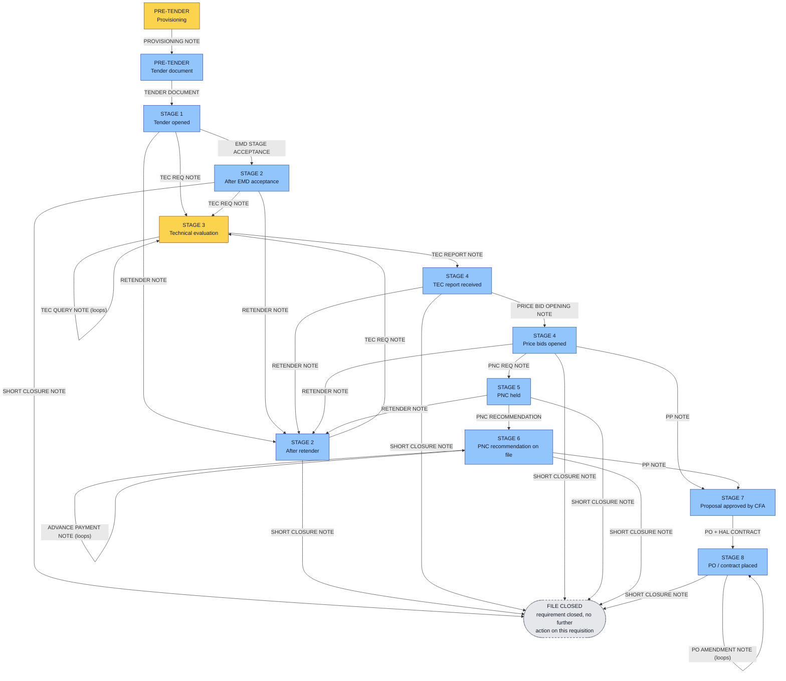
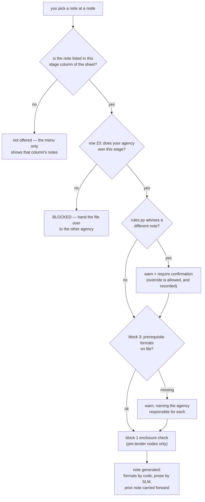

# Note & Format Cascade — the two agencies, and every condition in the flow

Source of truth (nothing here is invented):

```
sampleData/HAL PURCHASE FORMATS dt 22.06.2026/
    Note & Format Generation Stages and responsibility cascadeing.xlsx   [Sheet1]
```

Encoded in `ai/cascade.py`, executed by `ai/interactive.py`, and asserted against the
spreadsheet cell-by-cell by `ai/cascade_check.py` (**59/59 checks pass**).

The sheet recognises exactly two actors:

| Agency | Sheet evidence | Owns |
|---|---|---|
| **Indenting Agency** | `C6:C11`, `H23`, `G26` | the indent + technical evaluation (stage 3) and the TEC Report format |
| **Tendering Agency** | `C13`, `C16:C25`, `F23:G23`, `I23:M23`, `G27:G35` | the tender document and every stage except 3 |

---

## 1. The cascade — who holds the file, and what may be raised

Boxes are decision points (the sheet's stage columns `F`..`M` = stage 1..8). Edge labels
are the notes the sheet lists in that column. Colour = the agency named in row 23,
*"Note Can only be Generated by"*.



Every colour change on a path is a **hand-over**: the CLI refuses the note and makes you
move the file to the other agency first. A file that goes the normal route crosses three
times — Indenting raises the indent, Tendering runs the tender, Indenting does the TEC,
Tendering carries it to PO.

---

## 2. How the conditions work

Four kinds of condition act at each decision point, and they come from different places.
Only the first three are from the spreadsheet.



| # | Condition | Where it comes from | Effect |
|---|---|---|---|
| 1 | Notes available at a stage | sheet `F4:M21`, per column | **hard** — only those notes are offered |
| 2 | *"Note Can only be Generated by"* | sheet `F23:M23` (+ `C6:C25` pre-tender) | **hard** — blocks, forces a hand-over |
| 3 | Short closure ends the case | sheet `G18` | **hard** — terminal node, file closed |
| 4 | Prerequisite formats + who owns them | sheet `F26:H35` *"Required for"*, inverted | **warn only** |
| 5 | Enclosures complete | sheet `B6:C25` (block 1) | **warn only**, pending lines recorded |
| 6 | `pnc_required()` → advises PNC REQ NOTE | `rules.py` — **not in this sheet** (Purchase Manual / sample notes: L1 above estimate, or no RA participation) | **advisory** — override with confirmation |
| 7 | `retender_required()` → advises RETENDER NOTE | `rules.py` — **not in this sheet** (nil bids, or no EMD-accepted bidder) | **advisory** — override with confirmation |

Conditions 6 and 7 are shown as `undecided` until the case data they read is actually on
file (`rules.RULE_INPUTS`) — at stage 1 nothing has ingested `total_bids` yet, so the CLI
says so rather than advising off absent data.

**The spreadsheet contains no conditional logic of its own.** It says *which* notes are
possible at each stage and *who* may raise them — never *when* to prefer one. So every
branch edge above is unconditional and selectable; the only preferences shown are 6 and 7,
which are labelled with their rule name and are never binding.

---

## 3. Verification

`ai/cascade_check.py` re-reads the xlsx and asserts the encoding against it:

```bash
conda run --no-capture-output -n hal python ai/cascade_check.py
```

It checks the stage numbering (`row 24`), the note set of every stage column, the owning
agency of every stage column, the block-1 responsibility split, and all ten block-3 rows
with their responsibility and *"Required for"* mapping. The sheet's own typos
(`ACCPETANCE`, `NEGOTAITAION`, `EVALAUTION`, `JUSTIFCATION`) are matched verbatim rather
than corrected, so the check fails if the encoding silently drifts.

One deviation was found this way and removed: an `ADVANCE PAYMENT NOTE` option had been
placed at stage 7, but sheet column `L` holds `PO + HAL CONTRACT` and nothing else.

---

## 4. Running it

```bash
# interactive cascade (default on a terminal)
conda run --no-capture-output -n hal python ai/run.py
conda run --no-capture-output -n hal python ai/run.py -i --agency Tendering

# unattended full linear run (the original behaviour)
conda run --no-capture-output -n hal python ai/run.py --auto
```

`--no-capture-output` matters: plain `conda run` buffers stdio, so the prompts do not
appear. `conda activate hal && python ai/run.py` works too.

At each node: `1..n` picks a note, `f` lists the block-3 formats and who owns them,
`v` prints the file as it stands, `h` hands the file to the other agency, `q` saves and
quits. Notes are generated for real — deterministic annexures from `formats.py`, prose
from the SLM, prior notes carried forward — and the session ends with the path actually
walked, the responsibility split, the hand-over count, `outputs/case_full.json` and one
PDF per note.

---

## 5. Every decision, and what yes / no leads to

Diamonds are decisions. Amber = decided by the **Indenting Agency**, blue = decided by the
**Tendering Agency**. Rectangles are the notes raised as a result. Cell references are the
sheet cells that authorise each outcome.

```mermaid
flowchart TD
    classDef indD fill:#fcd34d,stroke:#92400e,color:#111827
    classDef tenD fill:#93c5fd,stroke:#1e40af,color:#111827
    classDef note fill:#f5f5f4,stroke:#57534e,color:#111827
    classDef term fill:#e5e7eb,stroke:#6b7280,color:#111827,stroke-dasharray:5 4
    classDef hold fill:#fee2e2,stroke:#b91c1c,color:#111827,stroke-dasharray:3 3

    D1{"INDENT INPUTS COMPLETE?<br/>specs · scope · certs · MPR/CAR"}:::indD
    N1["PROVISIONING NOTE"]:::note
    H1(["no indent — nothing to tender"]):::hold
    D1 -->|yes| N1
    D1 -->|no| H1

    D2{"COMMERCIAL SIDE READY?<br/>cond'ns · MII/LBS/NDA/IP/SD/PBG · IFS no"}:::tenD
    N2["TENDER DOCUMENT<br/>floated on GeM / E-Proc"]:::note
    H2(["tender not floated"]):::hold
    N1 --> D2
    D2 -->|yes| N2
    D2 -->|no| H2

    D3{"STAGE 1 · BIDS WORTH PROCESSING?"}:::tenD
    N2 --> D3
    D4{"STAGE 1 · EMD SCRUTINY APPLICABLE?"}:::tenD
    N3["EMD STAGE ACCEPTANCE NOTE"]:::note
    R1["RETENDER NOTE"]:::note
    D3 -->|yes| D4
    D3 -->|"no · F8"| R1
    D4 -->|"yes · F9"| N3
    D4 -->|"no · F10"| D8

    D5{"STAGE 2 · ANY EMD-QUALIFIED BIDDER?"}:::tenD
    N3 --> D5
    D6{"STAGE 2 · RETENDER WORTH FLOATING?"}:::tenD
    X(["FILE CLOSED · SHORT CLOSURE<br/>requirement closed, no further action"]):::term
    D5 -->|"yes · G10"| D8
    D5 -->|no| D6
    D6 -->|"yes · G9"| R1
    D6 -->|"no · G11 / G17"| X

    D7{"STAGE 2 · DID THE RETENDER<br/>BRING QUALIFIED OFFERS?"}:::tenD
    R1 --> D7
    D7 -->|"yes · G10"| D8
    D7 -->|"no · G17"| X

    D8{"STAGE 3 · CLARIFICATION NEEDED<br/>FROM BIDDERS?"}:::indD
    Q1["TEC QUERY NOTE"]:::note
    D8 -->|"yes · H11"| Q1
    Q1 -->|"replies received"| D8
    D9{"STAGE 3 · EVALUATION CONCLUDED?"}:::indD
    N4["TEC REPORT NOTE<br/>accepted · rejected · spec non-compliance"]:::note
    D8 -->|no| D9
    D9 -->|"yes · H12"| N4
    D9 -->|"no — still under evaluation"| D8

    D10{"STAGE 4 · ANY TECHNICALLY<br/>ACCEPTED BIDDER?"}:::tenD
    N5["PRICE BID OPENING NOTE"]:::note
    D10b{"STAGE 4 · RETENDER WORTH FLOATING?"}:::tenD
    N4 --> D10
    D10 -->|"yes · I13"| N5
    D10 -->|no| D10b
    D10b -->|"yes · I14"| R1
    D10b -->|"no · I17"| X

    D11{"STAGE 4 · IS L1 PROCESSABLE?"}:::tenD
    N5 --> D11
    D11 -->|no| D10b
    D12{"STAGE 4 · NEGOTIATION REQUIRED?<br/>rules: L1 &gt; estimate, or no RA"}:::tenD
    N6["PNC REQ NOTE"]:::note
    N8["PP NOTE"]:::note
    D11 -->|yes| D12
    D12 -->|"yes · I16"| N6
    D12 -->|"no · I15"| N8

    D13{"STAGE 5 · ACCEPTABLE OFFER<br/>FROM NEGOTIATION?"}:::tenD
    N7["PNC RECOMMENDATION"]:::note
    D13b{"STAGE 5 · RETENDER WORTH FLOATING?"}:::tenD
    N6 --> D13
    D13 -->|"yes · J17"| N7
    D13 -->|no| D13b
    D13b -->|"yes · J16"| R1
    D13b -->|"no · J18"| X

    D14{"STAGE 6 · ADVANCE PAYMENT SOUGHT?"}:::tenD
    A1["ADVANCE PAYMENT NOTE"]:::note
    N7 --> D14
    D14 -->|"yes · K19"| A1
    A1 --> D15
    D15{"STAGE 6 · PROCEED TO<br/>PURCHASE PROPOSAL?"}:::tenD
    D14 -->|no| D15
    D15 -->|"yes · K18"| N8
    D15 -->|"no · K20"| X

    D16{"STAGE 7 · PLACE THE ORDER?"}:::tenD
    N9["PO + HAL CONTRACT"]:::note
    H3(["stays at stage 7 — the sheet<br/>offers no alternative here"]):::hold
    N8 --> D16
    D16 -->|"yes · L19"| N9
    D16 -->|no| H3

    D17{"STAGE 8 · PO NEEDS AMENDMENT?"}:::tenD
    A2["PO AMENDMENT NOTE"]:::note
    N9 --> D17
    D17 -->|"yes · M20"| A2
    A2 --> D17
    D18{"STAGE 8 · DROP THE BALANCE<br/>REQUIREMENT?"}:::tenD
    OK(["PO runs to completion"]):::term
    D17 -->|no| D18
    D18 -->|"yes · M21"| X
    D18 -->|no| OK
```



### Tendering Agency — 15 decisions

| Stage | Decision | Yes → | No → |
|---|---|---|---|
| pre | Commercial conditions, formats, IFS enquiry no. ready? | Tender Document floated | tender not floated (hold) |
| 1 | Bids worth processing? | on to EMD question | **Retender Note** `F8` |
| 1 | EMD scrutiny applicable? | **EMD Stage Acceptance** `F9` | **TEC Req Note** direct `F10` |
| 2 | Any EMD-qualified bidder? | **TEC Req Note** `G10` | on to retender question |
| 2 | Retender worth floating? | **Retender Note** `G9` | **Short Closure** → closed `G11`/`G17` |
| 2 | Retender brought qualified offers? | **TEC Req Note** `G10` | **Short Closure** → closed `G17` |
| 4 | Any technically accepted bidder? | **Price Bid Opening** `I13` | on to retender question |
| 4 | Retender worth floating? | **Retender Note** `I14` | **Short Closure** → closed `I17` |
| 4 | Is L1 processable? | on to negotiation question | back to retender / short closure |
| 4 | Negotiation required? *(advised by `pnc_required()`)* | **PNC Req Note** `I16` | **PP Note** — straight to proposal `I15` |
| 5 | Acceptable offer from negotiation? | **PNC Recommendation** `J17` | on to retender question |
| 5 | Retender worth floating? | **Retender Note** `J16` | **Short Closure** → closed `J18` |
| 6 | Advance payment sought? | **Advance Payment Note** `K19`, then re-ask | skip it |
| 6 | Proceed to purchase proposal? | **PP Note** `K18` | **Short Closure** → closed `K20` |
| 7 | Place the order? | **PO + HAL Contract** `L19` | nothing — no alternative in column `L` |
| 8 | PO needs amendment? | **PO Amendment Note** `M20`, then re-ask | on to drop question |
| 8 | Drop the balance requirement? | **Short Closure** → closed `M21` | PO runs to completion |

### Indenting Agency — 3 decisions

| Stage | Decision | Yes → | No → |
|---|---|---|---|
| pre | Indent inputs complete? (specs, scope, proprietary/OEM cert, single-tender cert, MPR/CAR) | **Provisioning Note** | no indent — nothing to tender |
| 3 | Clarification needed from bidders? | **TEC Query Note** `H11`, then re-ask *(loops)* | on to conclusion question |
| 3 | Evaluation concluded? | **TEC Report Note** `H12` → file returns to Tendering | stays at stage 3 |

### The asymmetry this exposes

`RETENDER NOTE` appears only in columns `F`, `G`, `I`, `J` and `SHORT CLOSURE NOTE` only in
`G`, `I`, `J`, `K`, `M` — **every one of them a Tendering column**. Column `H` (stage 3) has
neither. So:

* Only the **Tendering Agency** can kill or restart a case. Its "no" can terminate.
* The **Indenting Agency**'s "no" never terminates and never retenders — it can only loop
  (raise another query) or hold the file at stage 3. Even "no bidder is technically
  compliant" is expressed as a TEC Report listing everyone as rejected; the decision to
  short-close or retender on the back of it is then Tendering's, at stage 4.
* The indentor therefore controls *whether the case can advance*, and the tendering agency
  controls *whether it lives or dies*.
